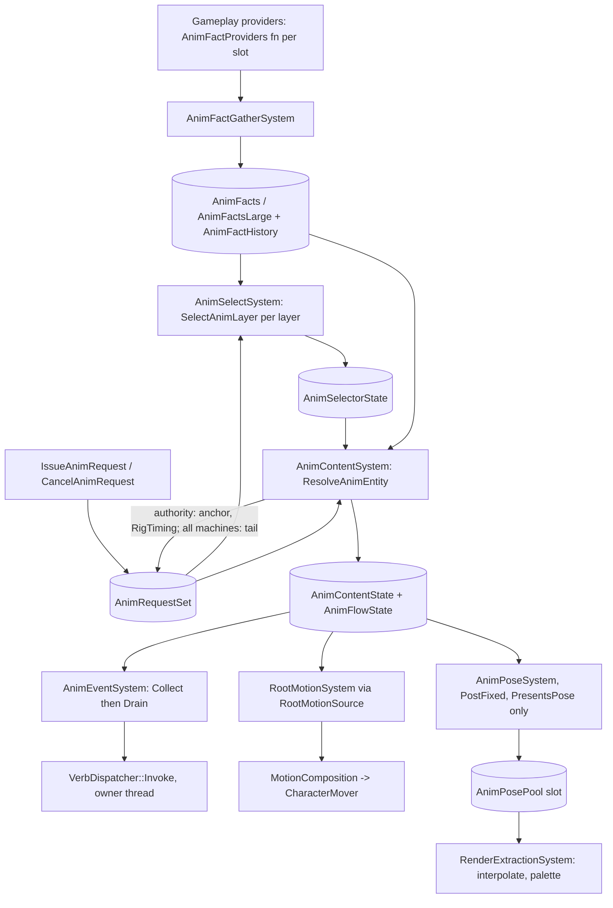

# Animation Runtime Review

Date: 2026-09-28. Branch `animator` at `ada4abae`. Scope: the animation runtime
(`engine/include/anim/`, `engine/src/anim/`) and its seams into movement, render
extraction, replication and the authored API. Editor UX is out of scope.

Measured against the plan of record (`docs/plans/animation-runtime.md`), the
subsystem doc (`docs/gameplay/animation.md`) and `CLAUDE.md`.

**Method and evidence.** The code was read, not run. Nothing was built,
reproduced or benchmarked for this review.

- **Confirmed** means the code path was read end to end.
- **Suspected** means the failure was inferred but not fully traced.
- Timings come only from the recorded measurements in `docs/gameplay/animation.md`.
- Every High finding below was checked against source by the lead reviewer.
- No regression test exists yet for any finding. Each fix should start with one
  that fails for the stated reason.

## Verdict

The architecture held. This is not an FSM under different names:

- Selection is flat first-match. The only self-reference is a rule's own stay
  predicate.
- A latch extends a winner's stay and never chooses one.
- Flows are forward-only, enforced when the flow loads.
- The one read against the dependency direction is `ContentComplete`, one tick
  late.
- No operand can name a rule, a behavior or content.
- Outside `anim/`, the only readers of animation state are render extraction
  (the pose pool) and movement's `RootMotionSource` sampler. Both are
  sanctioned.
- There are no `if player`, `if local` or `if server` branches. Gating uses
  `SimulationAuthority` and `AnimationHost::PresentsPose` only.
- Only `AnimRequestSet` replicates.
- Anchors have exactly one writer, the authority.

What did not survive is everything around that core:

1. **Nothing drives animation in a real game.** No template registers the
   systems, no engine code binds the core fact providers, and no ability or
   verb issues a request.
2. **Only the Prop tier can be authored in data.** Simple and Character need
   hand-written C++, and a mismatch between an entity's components and its rig
   fails silently.
3. **Event crossing is wrong in several ordinary cases.** Flow section tails
   are dropped, including gameplay-scope marks on the authority. Marks re-fire
   when a client's tick estimate repeats. Caught-up marks fire instead of being
   recorded as Skipped.
4. **Hot reload can index past a vector's end.** The slot-row "stable key" is
   positional.
5. **The client prediction path is incorrect** in three independent ways. It is
   latent only because nothing predicts requests yet.
6. **Every system re-validates the rig binding per entity per tick,** and reads
   same-chunk components through random-access `TryGet`.

No finding is Critical: no shipping game consumes this subsystem yet. Several
will become Critical the day one does. That is why the remediation plan fixes
correctness and the opt-in path before any gameplay adopts animation.

## Disposition (2026-09-28)

Phases A-C and the structural half of Phase E were remediated under the owner's
decisions, which supersede this review's proposed directions where they differ.
Phase D (performance) remains, recorded in `docs/deferred.md`. Each fix began with a regression
test run against the pre-change source (`ada4abae`), where it failed for the
stated reason; `docs/plans/animation-runtime.md`, "As built after the runtime
review", records the plan departures.

| Finding | Outcome | Pinned by |
| --- | --- | --- |
| R1 | Fixed. Every host registers animation; the runtime binds movement's facts; the ability kit and the `anim.request` / `anim.cancel` verbs issue through `RequestAnimation`. `Dead` left the engine schema. | `AnimAbility.*`, `AnimRequestVerbs.*`, template tests |
| R2 | Fixed (decision 1): `AnimRigCompositionSystem` provisions what the rig needs; pose needs a consumer (`SkinnedMesh` brings `AnimPoseConsumer`) and a presenting host. | `AnimRigComposition.*` |
| R3 | Fixed. Diagnostics log once per generation for every tier; unprovided slots and row-less behaviors warn; a mistyped rig binds invalid; content with no row ends at once. Render extraction warns once per entity whose rig poses another skeleton than its mesh skins. | `AnimRigDiagnostics.*`, `SkinnedPoseMatch.*` |
| R4 | Fixed: ordering edges declared by whichever feature registers second; request producers ordered before selection. | `AnimAbility.AnActivationIsPlayedOnItsOwnTick` |
| R5 | Fixed through `AnimPlayback`: an ended section is crossed to its end. | `AnimEvents.AFlowSectionPlaysItsLastMarksBeforeTheNext` |
| R6 | Fixed: a repeated or earlier tick crosses nothing. | `AnimEvents.ARepeatedOrEarlierTickFiresNothingAgain`, `AnimCrossing.*` |
| R7 | Fixed: late or corrected instances skip what went by; a carried instance plays its entry tick. | `AnimEvents.ContentFirstSeenLongAfterItBeganSkipsWhatWentBy`, `AnimEvents.ACarriedRowPlaysTheTickItTookOver` |
| R8 | Fixed (decision 3): authored row ids and rule names; flows relocate by section tag; lost rows clear content; the event cursor survives a rebind. | `AnimFlow.AReloadedFlowKeepsItsSectionByTag`, `ARowAddedAboveAPinnedRowLeavesItPlaying`, `ARemovedRowTakesItsContentWithIt` |
| R9 | Fixed (decision 6): producers own Held lifetime; orphans are reported, not ended. | `AnimAbility.AHeldRequestItsProducerForgotIsReportedNotEnded` |
| R10 | Fixed (decision 7): gaps skip at every scope. | `AnimEvents.MarksInSkippedTicksAreSkippedAtEveryScope` |
| R11 | Blendspace half fixed; the invariant-12 half is an open owner question (`docs/deferred.md`). | `AnimBlendspaceBinding.SamplesShareTheirGameplayEvents` |
| R12 | Fixed: adoption stamps the section's entry tick. | `AnimFlow.ASupersedeAfterALoopAnchorsTheSectionEntry` |
| R13 | Fixed: exits are attributed to the request that drove what was left; `Parent` is the request's cause. | `AnimRequestVerbs.ARequestFromContentIsTheInstigatorsAndParentsWhatItPlays` |
| R14 | Fixed (decision 4): gameplay and cosmetic queues apart; overflow counted, logged and recorded. | `AnimEvents.CosmeticTrafficCannotStarveAGameplayEvent`, `AGameplayOverflowIsCountedAndRecorded` |
| N1, N4 | Fixed (decision 5): the predicted entity runs on the command timeline; predictions match by replicated `Command`; decided once the authority has run their tick; replay uses command ticks. | `AnimReplication.AConfirmedPredictionPlaysOnWithoutACorrection`, `AnimRootMotion.APredicted*` |
| N2 | Fixed: `ToWire` leaves predictions out; the journal refuses past capacity. | `AnimReplication.ADeltaCannotLeaveAGuessLookingLikeTheAuthoritysRecord` |
| N3 | Fixed: predictions never supersede or deduplicate against authority records. | `AnimReplication.AGuessNeverTakesTheAuthoritysRecordsPlace` |
| N5 | Fixed: selector base layers derive the carrier from request records. | `AnimRootMotion.ASelectorLayersReplayIsCarriedThroughACancel` |
| N6 | Fixed: the identity hashes the root-motion flag and each clip's root curve. | `AnimRootMotion.TheTimingIdentityIncludesWhatCarriesTheCharacter` |
| N7 | Tails stay extended locally on clients (load-bearing for a flow playing a cancel out), now documented; the "uncertainty runs the rig" claim is corrected. | docs |
| O1 | Done. The event cursor and request accounting left `AnimContentState` for `AnimEventCursor` (the event system's) and `AnimRequestReport` (diagnostics, written by `NoteAnimRequestOutcomes`), each with one writer. Orphan passes moved off the request record into the report. Resolution's writes into the request set (timing stamp, anchors, tails) go through one function after every layer has read the set. | existing suites, `AnimAbility.AHeldRequestItsProducerForgotIsReportedNotEnded` |
| O2 | Done, behavior-preserving: `ResolveAnimEntity` is remap, target, decide (a pure `DecideLayerInstance` over a closed `LayerInstanceChange`), enter, advance (closed over flow, blendspace, clip), then the one request-set write. | existing suites |
| O3 | Done. `AnimPlayback` is the one clock for content, flows, events, pose and root motion; `IsNewerAnimRequest` is the one request order (content, root motion, requests); `AnimRigRunCache` is the one run-of-equal-handles resolver (composition, gather, select, content, events, pose, world report). The preview runs `RegisterAnimationSystems`' schedule; its verdicts come from the select system through `AnimSelectionExplanation`, and its systems are rebuilt with its World, so no cached query outlives the World it was built on. | `AnimCrossing.*`, preview suites |
| O4 | Documented: swapping a rig is remove plus add. | docs |
| O5 | Done. The unused `anim.layer.aim` tag and the extraction caches' unread clip cache are gone; the roadmap no longer describes the clip player as current; root motion is documented as the first layer's. `AnimPosePool::Slot::Owner` now guards the slot: only the entity a slot was assigned to reads or releases it. `AnimRigBindings::Entries` eviction stays with the performance pass. | `AnimPose.APoseSlotIsOnlyTheEntitysItWasAssignedTo` |
| FNV | The selector's digests use `core/hash/Fnv1a.h`. `AnimRigTimingIdentity` keeps its own construction, as `SmapWire.h` does, because machines compare it and the core helper disclaims cross-process stability; it now hashes root curves from the clip rather than a digest cached on the binding. | -- |
| P7 | Done in passing: `RootMotionSystem` caches its query. | -- |
| P1-P6, P8 | Deferred to the performance pass (`docs/deferred.md`). | -- |

---

## 1. Architecture as built

### Runtime data flow

### System order

All of these are registered by `RegisterAnimationSystems`
(`engine/src/anim/AnimationRegistration.cpp:220`). The order within a tick is:

| Phase | System | Declared edges |
| --- | --- | --- |
| FixedLogic | `AnimFactGatherSystem` | none against gameplay |
| FixedLogic | `AnimSelectSystem` | after gather |
| FixedLogic | `AnimContentSystem` | after select |
| FixedLogic | `AnimEventSystem` (collect, then drain on the owner thread) | after content |
| FixedLogic | `RootMotionSystem` (movement) | after content, **only if movement registered first** |
| Physics | character mover moves the capsule | phase boundary |
| PostFixed | `AnimPoseSystem` (owner-thread prep, then `ParallelFor`) | phase boundary |
| ExtractRender | extraction interpolates pool poses and builds palettes | phase boundary |

The clock is `AuthorityTickOf(localTick)`. On the authority that is the local
tick. On a client it is the local tick plus `NetClock` offset.

### Against the intended pipeline

The intended chain was facts + requests → selectors → behaviors → slot map →
content → pose + events.

| Stage | As built | Matches? |
| --- | --- | --- |
| Facts | 32-bit slots, open schema, closed derivations, per-slot provider function | Yes. Providers are a C++ table, which is sound, but see R1: nothing binds them. |
| Requests | 8 fixed records, no priority, supersede in place, impulse dedup, reject on overflow | Yes |
| Selectors | CNF predicates compiled to a closed stack program; flattened delegation; stay, hold and cooldown; weight rules as a second first-match list | Yes |
| Behaviors | Tag plus policy (kind, blend, latch, rate/start, late join, lifecycle bindings) | Yes |
| Slot map | Rows merged by priority across a stack of overlays, resolved every tick, applied by kind (pinned for one-shots and flows) | Yes. The "stable" row key is positional (R8). |
| Content | Clip, blendspace or flow, as a sentinel index on `AnimBoundContent` | Yes. Flow advance and content resolution are one function (O2). |
| Pose | Per-layer inertialize, crossfade or snap, then mask and compose | Yes |
| Events | Collected into fixed records, drained on the owner thread, one `Invoke` site | Yes on path. Wrong on crossing semantics (R5–R7). |

### Divergences from the plan

**Recorded in the tree.** These are acceptable and documented:

- The root curve lives in the clip, not in a separate `RootCurve` asset.
- Predicates are authored in CNF rows.
- The server skip is animation's own `DrivesGameplay` rule. The engine-wide
  participation tiers are in `docs/deferred.md`.
- Footprints are measured instead of claiming the Simple tier is under 100 bytes.

**Not recorded anywhere:**

- There is no `SectionEnded` feedback signal. Plan lines 43, 396 and Invariant
  19 name it; its role moved into `AdvanceAnimFlow`.
- Flow state also holds `SectionEnteredTick` and `Phase`. The plan says it holds
  exactly `{section, sectionStartTick, loopCount}`.
- `AnimFactHistory` is always added with facts. The plan adds it only when the
  schema has temporal derivations.
- `AnimFlowState` is forced on every Prop. The plan places it on Character tier
  or on rigs with flows.
- `AnimPoseState` is added to every rig entity on a posing machine, including
  rigs with no skeleton or no `SkinnedMesh`.
- The plan says "engine ships preset rigs". The presets are editor recipes
  (`AnimationRigRecipe.h`), not engine assets.
- The plan's per-tick flow `AnimFlowAdvance → AnimResolveContent` is a single
  function.
- The plan says Impulse records drop after one history horizon. Records prune
  only when a new request is inserted.
- `docs/gameplay/animation.md` says "a snapshot replaces the set with the
  authority's, wiping every prediction". Deltas do not do that (N2).

---

## 2. How an entity opts in

### What exists

| Tier | Components | How they arrive | Authorable in a scene? |
| --- | --- | --- | --- |
| Prop | `AnimRig` → `AnimRequestSet`, `AnimContentState`, `AnimFlowState` | `ComponentTraits<AnimRig>::DerivedComponents` (`AnimRig.h:32`) | **Yes**: `"anim_rig": { "rig": ... }` |
| Simple | Prop plus `AnimFacts` → `AnimFactHistory`, `AnimSelectorState` | `DerivedComponents` (`AnimFacts.h:63`) | **No**: `AnimFacts` has no `SENCHA_SCHEMA` |
| Character | Prop plus `AnimFactsLarge` (plus `AnimDecisionLog`) | as above | **No** |
| (posing) | `AnimPoseState` | added by `AnimPoseSystem` through a `CommandBuffer` on first pass | n/a (runtime-derived) |

To render a pose, the entity also needs a `SkinnedMesh` whose mesh skeleton is
the rig's skeleton. The only in-tree example is
`test/fixtures/content/assets/levels/golden_skinned_pose.sscene:181-191`.

### What a game must also do

None of the following is documented as a requirement, and no template does any
of it:

1. Call `RegisterAnimationSystems` from `OnRegisterSystems`, after
   `RegisterMovementSystems`. Only `test/fixtures/render_host/RenderHostGame.cpp:227`
   does this.
2. Bind a provider for every non-derived fact slot. The engine's
   `BindMovementAnimFacts` covers `Grounded`, `Speed` and `VerticalSpeed`, but
   is called only from tests. The core schema also declares `Dead`, which no
   provider publishes anywhere.
3. Add `AnimFacts` or `AnimFactsLarge` in C++. Which one must match the rig's
   `fact_capacity`.
4. Issue requests from C++. No ability-kit hook or authored verb issues them.

### Answers to the ticket's questions

- **Possession, controller, local player, net role.** None of these appear in
  `anim/`. NPCs, remote players, local players and non-pawn entities all go
  through the same machinery. This is good.
- **A rig without the full controller.** Yes: the Prop tier plays requests
  through a request-keyed layer with no facts or selector.
- **Simple playback without the Character tier.** Yes, as a one-layer rig whose
  behavior sets rate and start. The old clip player was retired cleanly: it has
  no runtime translation path, and its scene key now fails the cook.
- **Anything cheaper than a skinned rig.** No. There is no transform, property
  or UV animation. A rotating fan or a door with no skeleton has no path, and
  every Prop costs a skeleton, a `SkinnedMesh` and about 3.3 KB per entity on a
  client. The authoring plan defers node/property animation. It should be
  listed as a product gap rather than solved by growing `AnimRig`.
- **Is the composition sensible?** Deriving components from `AnimRig` is the
  right mechanism. The defect is that the second tier boundary sits on a
  component nobody can author, while the rig already declares what it needs.
  Today "I have a rig; what do I add?" has a data answer only for Prop tier.
  For Simple and Character the answer is C++ that must agree with a field in
  the rig asset. See R2.

---

## 3. Findings

Severity reflects consequence once a game consumes the subsystem.
IDs are for disposition: R = runtime/integration, N = networking,
O = ownership/structure, P = performance (section 4).

### R1 — High — No production path drives animation

- **Code:**
  - `RegisterAnimationSystems` has one non-test caller (render_host fixture).
  - `BindMovementAnimFacts` (`engine/src/movement/MovementAnimFacts.cpp:49`) is
    called only from `test/runtime/AnimFactTests.cpp`.
  - `IssueAnimRequest` and `AnimRequestJournal::Issue` are called only from tests
    and `editor/animation_editor/`.
  - `engine/assets/animation/engine.facts.sdata` declares `Dead`, with no
    provider anywhere.
- **Current behavior:** A pawn given an `anim_rig` in any template does nothing.
  Adding the systems by hand gives a character rig that reads `Speed = 0` and
  `Grounded = false` forever, and no ability can ask it to play anything.
- **Why it matters:** The plan says abilities write requests. None do, and
  there is no designed producer: no request verb and no ability-kit
  integration. The integration is the part most likely to force changes to the
  request API, and it has not been exercised by any consumer.
- **Consequence:** Every guarantee below is proven only in fixtures. None of
  these gaps is recorded in `docs/deferred.md`.
- **Direction:**
  - Wire movement's providers where movement is registered.
  - Pick the request producer: an ability-kit hook or an authored verb such as
    `anim.request`. This is a design decision for the owner.
  - Make one template consume the whole path end to end.
  - Record whatever is not done in `docs/deferred.md`.

### R2 — High — Tier storage is chosen in two places, and mismatches fail silently

- **Code:**
  - Only `AnimRig` carries `SENCHA_SCHEMA` (`AnimRig.h:15`).
  - Fact capacity is declared by the rig (`AnimRigData.cpp:131`) and separately
    by whoever adds `AnimFacts` or `AnimFactsLarge`.
  - `AnimSelectSystem` iterates only the two fact queries
    (`AnimSelectSystem.cpp:619-630`).
  - Selection and content truncate fact spans to the entity's storage
    (`AnimSelectSystem.cpp:578`, `AnimContentSystem.cpp:575-578`).
- **Current behavior:**
  - A rig with selector layers on an entity without facts plays its idle
    forever, with no diagnostic.
  - A Large rig on Small storage is refused by gather (logged once), but select
    and content still run on a truncated span. Slots past 16 read as 0 and the
    rest stay frozen.
  - An entity with both storages is gathered and selected twice per tick
    (suspected; not guarded).
  - A request-only selector rig must carry facts just to get selector state.
- **Why it matters:** This is the "magic component combination" the ticket
  warns about. The rig already knows its tier, and the entity is asked to
  restate it.
- **Direction:** Let the binding provision the storage the rig needs. The
  `Unposed` + `CommandBuffer` pattern already does this for `AnimPoseState`.
  - Provision Small or Large facts from `fact_capacity`.
  - Provision `AnimFactHistory` only with temporal derivations.
  - Provision `AnimSelectorState` when any layer has a selector.
  - Provision `AnimFlowState` only when the rig plays flows.

  Tier is then what the rig declares, and "add `anim_rig`" is the whole answer.
  This rewrites Invariant 17 ("tier is component presence") into "tier is
  what the rig declares, realised as component presence", so it needs the
  owner's ruling. The smaller alternative is to give `AnimFacts` and
  `AnimFactsLarge` schemas and diagnose every mismatch.

### R3 — High — Broken content is silent at runtime

- **Code and current behavior:**
  - **Unbound fact slot.** `AnimRigBinder::BindProviders` leaves
    `Provider = -1` with no diagnostic (`AnimRigBinding.cpp:250-252`). Gather
    skips it (`AnimFactGatherSystem.cpp:31`), so the slot reads its initial 0.
  - **Diagnostics are logged only from gather.**
    `AnimFactGatherSystem::Bind` (`AnimFactGatherSystem.cpp:56-68`) is the one
    runtime logging point, and it visits only entities with facts. A Prop rig
    that fails to bind is never reported and draws in bind pose.
  - **Missing rig or wrong subtype.** `AnimRigBindings::Resolve` returns null
    before `Bind` (`AnimRigBinding.cpp:481`), so `anim.asset.wrong_subtype`
    cannot be reached at runtime. `IssueAnimRequest(World&)` then accepts any
    intent unvalidated and derives no `TagParams` (`AnimRequests.cpp:241-273`),
    so tag params travel as raw local ids.
  - **Behavior with no slot row.** It resolves to `kAnimNoContent`
    (`AnimContentSystem.cpp:302-305`) and a one-shot never completes
    (`:514-517`). A latched one-shot therefore holds its layer forever. Binding
    does not check that every selectable or idle behavior has a row.
  - **Mesh and rig skeletons disagree.** Extraction silently draws bind pose
    (`RenderExtractionSystem.cpp:351-357`). Binding checks clips against the
    rig skeleton but never checks the mesh.
- **Why it matters:** `CLAUDE.md` requires failures to be deterministic and
  diagnosable. Each of these is deterministic and none is diagnosable without
  a debugger.
- **Direction:**
  - Move reporting into `AnimRigBindings`, once per rig generation, for every
    tier.
  - Add bind-time warnings for an unprovided non-derived slot and for a
    behavior reachable by a rule or idle that has no row.
  - Log a missing or mistyped rig once per handle.
  - Check mesh against rig skeleton once per entity per rig generation.

### R4 — Medium — Registration relies on call order and on a free function

- **Code:** `schedule.After<RootMotionSystem, AnimContentSystem>()` is declared
  only `if (schedule.Get<RootMotionSystem>() != nullptr)`
  (`AnimationRegistration.cpp:233`). Nothing orders request producers (such as
  `AbilityActivationSystem`) before `AnimSelectSystem`.
- **Current behavior:** Register animation before movement and the edge is not
  declared. Root motion then works only because stable topological order
  happens to keep content first.
- **Direction:** Assert the order, as the ability kit already asserts its
  edges, or declare the edge from whichever registration runs second. Name the
  request-producer edge when R1 picks a producer.

### R5 — High — Flow section tails lose their marks, gameplay-scope included

- **Code:**
  - A section ends on `start + ceil(duration / dt)` (`AnimFlowRunner.cpp:22-26`).
  - On that tick the runner enters the next or looped section and overwrites
    `Layer.Clip` and `ClipStartTick` (`:59-65`).
  - `CollectAnimEvents` crosses only the current `layer.Clip`
    (`AnimEventSystem.cpp:206-208`). The instance changed, so it takes the entry
    path for the new clip (`:258-267`).
- **Current behavior:** Marks in the outgoing section's last partial tick,
  `(elapsed(end−1), duration]`, are never crossed and never recorded as
  Skipped. A mark at normalized 1.0 is always lost.
  - This applies on next, loop, branch and at-section-end cancel.
  - With a 0.25 s section at 60 Hz, anything after 0.933 is lost.
  - It happens on the authority too, which the plan says never skips a
    gameplay event.
- **Consequence:** A pump reload's shell-insert mark placed near its section
  end silently never reaches gameplay. The flow fixtures carry no clip events,
  so nothing catches it.
- **Direction:** When the runner ends a section, cross the outgoing clip up to
  its duration before the new section's entry. The runner already returns an
  outcome that can carry the ended section's clip and start.

### R6 — High — A repeated or backward tick re-fires marks

- **Code:**
  - `sameClip` requires `layer.EventTick < now` (`AnimEventSystem.cpp:102-103`).
    Otherwise the entry path crosses from `ClipOffsetSeconds` to now
    (`:258-267`), up to 64 loops for cyclic content (`:17, 44`).
  - On a client, `now` is `AuthorityTickOf`, and the offset slews ±1 per clock
    observation (`NetTickEstimator.cpp:89`, `kSlewTicks = 1`) or snaps.
- **Current behavior:** A −1 slew repeats `now`. Every animated entity on that
  client then re-fires every mark since its content instance began: footsteps,
  sounds, particles. Cyclic content can flood the event queue. Only
  gameplay-scope marks are safe, because they are authority-only. The live
  `RootMotionSystem` also applies a repeated tick's delta twice.
- **Frequency:** Not measured. The mechanism is confirmed in code.
- **Direction:** Treat `now <= EventTick` as "nothing crossed". Identify a
  content instance by its start and content, not by tick monotonicity. Decide
  whether the client's animation clock may ever step back; if it may not,
  clamp it at one owner.

### R7 — Medium — Time skips fire marks that should be Skipped, and carry ticks drop marks

- **Code:**
  - Late join (`EventTick == kAnimNoTick`), `Reconstructed`, `RequestCorrected`
    and a flow following an anchor into the past all reach the entry path.
    That path produces, rather than skips, every mark from the instance start
    to now.
  - A sync-group carry or cyclic row change starts at `now` with the carried
    offset (`AnimContentSystem.cpp:363-370, 398-408`). The entry path starts
    strictly after that offset, so the outgoing content's slice
    `(t(now−1), t(now)]` is never evaluated. The comment at
    `AnimEventSystem.cpp:263-264` says the previous content crossed it; it did
    not.
- **Current behavior:**
  - A late joiner replays every cosmetic mark of a long request.
  - A corrected start duplicates marks the prediction already fired.
  - A footstep on the walk-to-run tick is dropped. That is exactly the case
    phase carry exists for.
- **Direction:** Only the "event pass did not run" gap currently produces
  Skipped. Give each time jump its own crossing mode, matching the plan's
  table. Cross the outgoing content's last slice on carry.

### R8 — High — Hot reload can read out of bounds and mis-remap content

- **Code:**
  - Slot-row keys are `AnimStableKey("{path}#{index}")`
    (`AnimSlotMapBinding.cpp:144`), so they are positional. Selector rules are
    keyed by name.
  - On rebind, a flow layer whose row key survives is not re-entered. The runner
    then indexes `flow.Sections[Flow.Section]` with the old section index and no
    bounds check (`AnimFlowRunner.cpp:140-141`). Anchor sections from the wire
    are bounds-checked (`:116, 124`); the entity's own stale state is not.
  - An unpinned row removed with no replacement sets `layer.Row` to
    `kAnimNoContent` but keeps `layer.Content` (`AnimContentSystem.cpp:286-297`).
    When nothing resolves, no branch runs, so the stale index plays against the
    new content table.
- **Current behavior:**
  - Reloading a flow with fewer sections is undefined behavior.
  - Inserting a slot row above a pinned row silently moves that entity onto
    other content, with no `IndexReset`.
  - The doc claims these keys are stable (`docs/gameplay/animation.md:271-273`).
- **Suspected:** Rebind can fire spurious `SectionExited` and `SectionEntered`,
  because the event pass compares an old content index against a remapped one
  (`AnimEventSystem.cpp:106, 194-196`).
- **Direction:**
  - Reset or bounds-check flow state whenever the rig generation moves.
  - Key rows by something authored. A row has no name today, so this touches the
    slot-map format and needs escalation. An interim key of behavior + ordinal
    within the behavior is better than a global position.
  - Clear `Content` when its row is lost.
  - Add regression tests for all three cases.

### R9 — Medium — A `Held` request outlives a dead source

- **Code:** `Held` ends only through `CancelAnimRequest`. Nothing in `anim/`
  checks whether the source is still alive (the journal's `IsAlive` check is on
  the animated entity).
- **Current behavior:** An ability removed, or a source despawned, without
  cancelling leaves the record live forever. Eight such records reject every
  later request with `Capacity`.
- **Direction:** Pick an owner for the policy. Either the ability system cancels
  on teardown, which `CLAUDE.md` would favor, or prune records whose source is
  dead. Either way, test it.

### R10 — Medium — A waking zone bursts gameplay events on the authority

- **Code:**
  - Dormant partitions are skipped by `ForEachChunkIn`. When the zone wakes, the
    gap path produces every gameplay mark in the stretch
    (`AnimEventSystem.cpp:223, 270-275`), capped at 64 loops.
  - Loops beyond the cap are dropped with no record.
  - The blendspace gap path unwraps only one loop (`:251-256`).
- **Current behavior:** The plan assumes "the authority is never the machine
  catching up". Dormancy breaks that assumption.
- **Direction:** Decide what dormancy means for animation timing. Most likely
  its gameplay marks are Skipped, or dormant rigs do not advance content
  time. Record the rule in the plan.

### R11 — Medium — Invariant 12 is not enforced for gameplay events

- **Code:**
  - Binding rejects Reconstruct and root motion on behaviors reachable without a
    request (`AnimSelectorBinding.cpp:199-213`). Nothing rejects gameplay-scope
    clip events or lifecycle bindings on such behaviors, including idles.
  - Blendspaces play their heaviest sample's marks, and nothing requires the
    samples to share a gameplay track. The `anim.slot.local_events` check
    compares slot rows only.
- **Consequence:** Gameplay timing can depend on fact-driven blend weights and
  cannot be reconstructed. Machines cannot disagree, since only the authority
  fires these, but it is still the drift the invariant exists to stop.
- **Direction:** Add both checks to binding.

### R12 — Medium — Adopting a superseding request stamps the loop start, not the section entry

- **Code:** `AnimContentSystem.cpp:452-455` stamps
  `AnchorSectionStartTick = SectionStartTick`. The follower compares against
  `SectionEnteredTick` (`AnimFlowRunner.cpp:131-133`), and `AnimFlowState.h`
  says the entry tick is what gets stamped.
- **Current behavior:** A supersede after one or more loops makes followers
  re-enter the section with `LoopCount = 0`. They play extra Count loops and
  re-fire marks. The existing test supersedes before any loop.
- **Direction:** Stamp `SectionEnteredTick`, and test a supersede after a loop.

### R13 — Low — Event attribution is incomplete

- **Instigator:** it is computed once per layer after resolution
  (`AnimEventSystem.cpp:125-126`). `BehaviorExited` and `SectionExited`
  therefore name the replacing request's source, not the request that drove
  what was exited.
- **Parent:** always 0. `AnimRequestId` carries no `InvocationId`, so the causal
  chain from ability verb to request to event is lost.
- **Tick:** on clients, animation stamps authority-timeline ticks, while
  `VerbRelaySystem` stamps local ticks into the same field.
- **Direction:** Attribute exits from the previous `layer.Request`. Record the
  Parent gap in `docs/deferred.md` until requests carry a causal id.

### R14 — Low — Event queue overflow is invisible without a decision log

- **Code:** `Record` returns early with no log (`AnimEventSystem.cpp:76`).
- **Current behavior:** A refused gameplay event on an unlogged entity leaves
  no trace. Which entity starves depends on chunk order, which is
  deterministic but not fair.
- **Direction:** Count refusals per World and report them through `anim.risk`
  or a log line once per tick that overflows.

### N1 — High (latent) — Prediction mixes two clocks

- **Code:**
  - Client animation runs at `AuthorityTickOf`, the authority's estimated
    present. Commands are stamped `local + CommandOffset`, where
    `CommandOffset = Offset + Flight + Slack`.
  - The server processes command C at its tick C and stamps `StartTick = C`.
  - The journal confirms a prediction only if
    `StartTick == IssuedTick` (`AnimRequestJournal.cpp:27-34`).
  - Replay maps command C to anim tick C − lead (`EngineFramePhases.cpp:539`).
- **Current behavior:**
  - With any command lead, a correct prediction is judged refused. That sets
    `Reconstruct`, which wipes selector state and restarts content.
  - Root motion for a predicted pawn runs lead ticks behind the server, so every
    root-motion move is corrected at start and end.
  - The test fixture sets the client clock equal to the authority's, which hides
    all of this.
- **Direction:** Decide which clock owns a locally predicted entity's animation.
  The likely answer is command time for predicted requests and root motion.
  Have the journal match by command, not start tick. Add a paired test with
  non-zero Flight + Slack.

### N2 — High (latent) — A snapshot delta strips `Predicted` from surviving predictions

- **Code:**
  - A codec delta is applied onto `ToWire(receiver's current value)`
    (`ReplicationSnapshot.cpp:1181-1201`).
  - `ToWire` encodes predicted records like any other
    (`AnimRequestWire.cpp:39-73`).
  - `FromWire` resets every record (`:83-89`).
- **Current behavior:** Suppose a refused prediction sits in a slot the delta
  did not touch. It survives as an apparently authoritative record,
  `Reconcile` counts it as confirmed, and the authority never resends the slot.
  A `Held` prediction then plays forever.
  - A prediction past the journal's 32-entry capacity is marked `Predicted` but
    never tracked, so nothing ever takes it down.
- **Direction:** `ToWire` skips `Predicted` records. The journal's re-issue
  restores the undecided ones. Record at capacity rather than past it.

### N3 — High (latent) — A refused prediction destroys the authoritative record it replaced

- **Code:**
  - A same-source, same-intent request supersedes in place
    (`AnimRequests.cpp:127-141`).
  - An impulse dedup returns the existing authoritative id, which
    `MarkPredicted` then flags.
  - On refusal, `Reconcile` sets `*prediction = AnimRequest{}`
    (`AnimRequestJournal.cpp:71`).
- **Current behavior:** The authority's combo step or impulse vanishes locally
  and is never resent.
- **Direction:** Predictions become an overlay that never overwrites an
  authoritative slot, or refusal restores the overwritten record. Dedup hits
  are not flagged.

### N4 — Medium — The journal assumes a request is issued on its command's tick

- **Code:** "Decided" means `CommandTick <= ack` (`AnimRequestJournal.cpp:66`).
- **Current behavior:** An ability that issues its request later, such as after
  a wind-up, is taken down as refused and then reappears when the authority
  issues it.
- **Direction:** Settle this together with N1.

### N5 — Medium — Root-motion replay on a selector layer reads current content

- **Code:** `PlaybackFromLayer` uses the current `ClipStartTick`
  (`AnimRootMotionSource.cpp:74-91`). The doc admits this.
- **Direction:** Binding already requires a request on every path to a
  root-motion behavior (`AnimSelectorBinding.cpp:209`). The selector path can
  therefore derive the carrier from the latched or entering intent's records
  with `WasAnimRequestLive`, as the request-keyed path does.

### N6 — Medium — The timing identity omits root motion

- **Code:** `Policy.RootMotion` and the clip's root curve are not hashed
  (`AnimRigTimingIdentity.cpp:137-153, 180-192`).
- **Current behavior:** A client with a different curve reports agreement while
  moving the pawn differently.
- **Direction:** Hash the flag and the curve.

### N7 — Low — Smaller authority inconsistencies

- **Tails are not authority-only.** `ExtendAnimRequestTail` runs on every
  machine (`AnimContentSystem.cpp:446-449`). The doc says tails are the
  authority's.
- **"Uncertainty runs the rig" never fires.** `DrivesGameplay = !Valid || …`,
  but every consumer skips invalid rigs first. An unloaded clip makes the rig
  invalid, so the `!content.Clip.IsValid()` branch (`AnimRigBinding.cpp:393`)
  cannot be reached. `AnimServerParticipationTests.cpp:118-121` passes for that
  reason. On a headless authority, a rig that is still loading runs nothing,
  then fires its gameplay marks late on the bind tick.
- **Suspected:** `IsSimulationAuthority` defaults to true when the resource is
  missing. A client World animating before its first publication would act as
  the authority.

### O1 — Medium — Two components have several writers or several jobs

- **`AnimRequestSet` has four writers:**
  - the request API;
  - `AnimContentSystem`, for the anchor, `RigTiming` and tail;
  - replication;
  - the journal.

  The plan sanctions the authority's anchor. `RigTiming` and tails are further
  writes from content resolution into gameplay's record, the tail on every
  machine (N7).
- **`AnimContentState` holds three concerns:**
  - what plays;
  - the event cursor (`Event*` fields), written by the event system;
  - unplayed-request accounting (`RequestSeen`, `RequestPlayed`,
    `UnplayedRequests`), a diagnostic.
- **Direction:** Keep the event cursor beside content only if it stays
  per-layer and hot; say so in the subsystem doc. Move unplayed accounting to
  the diagnostics side. Collect the authority's writes into one named step
  (see O2) so there is exactly one place where animation writes a request.

### O2 — Medium — `ResolveAnimEntity` is the subsystem's god function

- **Code:** `AnimContentSystem.cpp:224-532`, about 300 lines. In order, it:
  1. remaps on rebind;
  2. stamps the timing identity;
  3. finds the driving request and behavior;
  4. resolves the row;
  5. decides among five instance-start branches;
  6. advances flows and stamps anchors and tails;
  7. advances blendspace phase;
  8. computes clip time;
  9. does unplayed accounting.
- **Why it matters:** This is where a new engineer must understand "why is this
  playing". The plan's separate `AnimFlowAdvance` and `AnimResolveContent`
  stages exist only as comments inside it.
- **Direction:** Split it into named steps with one owner each:
  - `DecideLayerInstance` (the start/carry/supersede/correct decision, pure);
  - `AdvanceLayerContent`, a closed dispatch over clip, blendspace and flow;
  - `StampAuthorityProgress`, the one writer back into the set;
  - accounting.

  This is behavior-preserving and needs no new abstraction.

### O3 — Medium — Timing mechanisms are duplicated

- **Ticks to clip seconds** (`offset + (t − start) · dt · rate`) appears six
  times:
  - `AnimEventSystem.cpp:19-24`
  - `AnimContentSystem.cpp:323-325`
  - `AnimContentSystem.cpp:511-513`
  - `AnimFlowRunner.cpp:195-196`
  - `AnimPoseEvaluation.cpp:213-215`
  - `AnimRootMotionSource.cpp:118-120`
- **Wrapping** is implemented twice: `PlacedTime` and
  `AnimPoseEvaluation.cpp:217-226`.
- **The newest-request comparator** appears twice.
- **Cyclic unwrap** differs: root motion's is uncapped, while events cap at 64.
- **The editor preview** hand-sequences the systems
  (`AnimationPreviewSession.cpp:838-870`), restating the schedule's order.
- **Why it matters:** R5, R6 and R7 are all defects in how time is crossed. One
  clip clock would have one place to be right.
- **Direction:** Extract one playback-time type (start tick, offset, rate,
  cyclic → seconds at tick, crossing range between ticks). Content, events,
  pose, flows and root motion then share it. The preview should run a
  schedule, or a shared ordered list, instead of its own sequence.

### O4 — Low — Swapping a rig in place leaks its lease

- **Code:** `SchemaAssetOwnership` has only `OnAdd` and `OnRemove`
  (`world/ComponentAssetOwnership.h:61-73`).
- **Current behavior:** Assigning `AnimRig::Rig` keeps the old lease, and
  removal later releases the new handle. Selector and content state themselves
  remap soundly on rebind.
- **Scope:** This is an engine-wide contract, not an animation defect.
- **Direction:** Document "swap is remove plus add", or give asset ownership a
  replace path.

### O5 — Low — Vocabulary and legacy leftovers

- **Hard-coded layer tags.** `InstallAnimationVocabulary` registers
  `anim.layer.base`, `upper` and `aim` in C++, beside the
  `gameplay.tag_declarations` route. `aim` is used nowhere.
- **"Base" means index 0.** Root motion reads layer index 0, not the tag. That
  is fine, but the doc should say "first layer".
- **Stale clip-player references:**
  - `RenderExtractionSystem.h:153-155`
  - `RenderExtractionSystem.cpp:331-333`
  - `docs/plans/engine-roadmap.md:232-241`, which describes
    `AnimationClipPlayerComponent` and a state graph as current.
- **Dead state:**
  - `AnimPosePool::Slot::Owner` is written and never read, and the slot handle
    has no generation.
  - `AnimRigBindings::Entries` is never evicted.

---

## 4. Performance

Measured, from `docs/gameplay/animation.md`:

| Workload | Result |
| --- | --- |
| Pose pass | 7.2 µs per 62-joint two-layer character, serial; 1.6 µs on 7 workers |
| Headless cosmetic prop | 0.26 µs skipped; 0.48 µs run |
| Steady state | zero allocation over the covered paths |

**There is no bench of the logic tick** (gather, select, content, events) for
Simple or Character entities. Every logic-cost statement below is therefore
structural, not measured.

### Per-entity footprint

These are hand-computed sizes that reproduce the measured tier totals.

| Component | Bytes | Note |
| --- | --- | --- |
| `AnimRequestSet` | 720 | 8 × 88 |
| `AnimContentState` | 1080 | 8 layers × 128 |
| `AnimFlowState` | 192 | forced on every Prop |
| `AnimFactHistory` | 784 | 32 derivation slots; fixtures use 1 |
| `AnimSelectorState` | 800 | 8 layers × 96 |
| `AnimPoseState` | 1168 | 8 layers × 144; plus pool heap per joint and layer |
| `AnimDecisionLog` | 4616 | inline 64-record ring |

Rows per 16 KB chunk, counting animation components only:

| Tier | Rows |
| --- | --- |
| Prop | 8 (5 with pose) |
| Simple | 4 (3 with pose) |
| Character with log and pose | 1, leaving 41% of the chunk unused |

Arrays sized for 8 layers account for 3136 B per entity. A one-layer prop uses
one eighth of that.

### Confirmed structural problems

- **P1 (High): The binding is validated per entity per system.**
  - `Resolve` does a subtype check, a map lookup and then `IsCurrent`.
    `IsCurrent` walks every asset version and every clip version, hashes the
    skeleton path string, and makes about five resource lookups
    (`AnimRigBinding.cpp:451-485`).
  - It is called per entity by select, content, events (twice), pose and the
    root-motion sampler.
  - Only gather caches runs of equal handles, so one policy exists in two
    forms.
  - The recorded headless skip cost is almost entirely this, measured with a
    one-clip rig. Cost grows with clip count.
  - **Direction:** Validate each rig once per tick through a bindings epoch, or
    invalidate on push from the caches and registries. Per-entity resolution
    then becomes a lookup, with one shared run cache.
- **P2 (High): Components in the same chunk are read through `World::TryGet`.**
  - Each `TryGet` does a component-id hash, a liveness check, a location lookup
    and a linear column search. Call sites usually add an `IsRegistered` hash
    first.
  - A character pays roughly 20 of these per tick, plus one per gathered slot
    in `ReadField`.
  - **Root cause:** `Query` has no optional-column accessor. Per `CLAUDE.md`
    this is an ECS contract to escalate (an `Optional<T>` column view), not
    something to work around inside animation.
- **P3 (Medium-High): Fixed capacities set the stride.**
  - 10k props hold 20 MB of animation state, most of it unused layer slots.
  - **Direction:** Size per-layer state by the rig: a layer-count tier like the
    Small/Large fact split, or rig-shaped pooled storage in the style of
    `AnimPosePool`. Derive flow and history only when used.
  - None of the per-layer components replicate or carry a schema, so this is a
    local change. `AnimRequestSet` is a wire format and is out of scope for
    resizing.
- **P4 (Medium): The selector skip gate rarely skips moving characters.**
  - `FactDigest` hashes every slot, including slots no selector reads, one byte
    at a time.
  - Any tag test, time test or active latch anywhere on the entity disables the
    gate.
  - When the gate fails, the digest is computed twice.
  - `AnimContentSystem` has no gate.
  - **Direction:** Digest only the slots the selectors read. Turn time
    thresholds into `WakeTick`. Compute the digest once.
- **P5 (Medium): Content resolution scans cold binding records every tick.**
  - `ResolveAnimSlotRow` walks all rows per layer. Rows are about 200 B each,
    including strings and a program.
  - `FindBehavior` is a linear scan, called several times per layer.
  - **Direction:** Split `AnimBoundRig` into a hot part (per-behavior row
    ranges, dense behavior indices) and cold names and diagnostics.
- **P6 (Medium): The pose pass has no relevance hook and over-samples.**
  - Every rig entity is posed every fixed tick, visible or not.
  - Masks apply only at composition, so masked, zero-weight and contentless
    layers still sample the full skeleton (`AnimPoseEvaluation.cpp:380-387`).
  - Additive layers sample a reference pose too.
  - **Direction:** Skip layers that contribute nothing; sample only masked
    joints. Culling or relevance waits for participation LOD, which is already
    deferred.
- **P7 (Medium): `RootMotionSystem` builds a `Query` every tick.**
  (`movement/RootMotionSource.cpp:54`). That breaks the cached-query rule and
  allocates, and the allocation test does not cover it.
- **P8 (Medium, ECS): A row over 16 KB is only asserted.** `Archetype.h`
  clamps rows per chunk to 1 and only `assert`s the layout. A release build
  whose archetype exceeds the chunk writes past it. Character with log and
  pose is already 9.6 KB before gameplay components. The fix belongs to ECS:
  fail loudly in release. The deferred decision-log move also removes most of
  the exposure.

### Allocation test gaps

`AnimSteadyStateAllocationTests` runs 12 Simple entities with a null dispatcher
and clips without events. So "events allocate nothing" is untested. It also
does not cover:

- flows and blendspaces;
- Large facts and tag queries;
- root motion;
- rebinding;
- spawn and despawn (`AnimPosePool::Shape` allocates per slot);
- overflow;
- replication apply;
- the headless path.

### Scaling estimates

These are unmeasured except where they build on the pose figures above.

| Scenario | Estimate |
| --- | --- |
| 1 character | negligible |
| Dozens of characters | fine: pose about 0.25 ms serial |
| Hundreds of Simple entities | pose is fine in parallel. The logic tick is serial and pays P1, P2 and P4 in full. Estimated 1–3 ms per 500 entities, to be measured first. |
| AI-heavy | P4 means moving agents never skip selection |
| Multiplayer client | every remote pawn is posed, with no relevance culling. Replication itself is cheap: a resting set costs 0 bytes. |
| Headless server, 10k cosmetic props | about 2.7 ms just to visit and skip, extrapolated from a trivial rig; real rigs cost more. Plus about 20 MB of state. |

Speculative: whether a catch-up frame re-poses unshown ticks. PostFixed runs
per step, but this was not verified.

---

## 5. Networking and authority

| Question | Answer |
| --- | --- |
| Dedicated servers | **Conditionally safe.** Cosmetic rigs are skipped. Rigs with flows, root motion or gameplay events run their timing half without posing. Caveats: R5 loses gameplay marks at section ends, R10 bursts marks when a zone wakes, and a rig still loading runs nothing until it binds (N7). |
| Authoritative gameplay events | **Correctly gated, incorrectly crossed.** Produced only where `SimulationAuthority` holds, never by a client, and never twice on a listen server. The crossing defects R5, R10 and R11 apply. |
| Prediction | **Not safe.** N1, N2 and N3 are each independently wrong. Latent only because nothing predicts requests yet. |
| Replay | **Sound for request-keyed root motion**: the carrier derives from the records' own ticks and replays through cancels. N1 offsets the whole timeline by the command lead, and N5 applies to selector base layers. Animation is not rewound, as designed. |
| Remote proxies | **Sound model:** requests with authority ticks, anchors, timing identity, a tail adopted on join, correction by restart. Cosmetic marks re-fire on clock slew (R6) and on late join (R7). |
| Future multiplayer | **The architecture needs no rewrite.** Replicating requests only, with one authority-written anchor and a portable timing identity, is the right shape. It is bandwidth-bounded and measured: a held request costs 90 B to start and 0 B at rest. What must be rebuilt before use is the client prediction path (N1–N4) and the event clock (R6, R7). |

---

## 6. Remediation plan

The order is correctness before integration, integration before performance, and
structure last. Each item starts with a regression test that fails for the
stated reason. Items marked **escalate** need the owner's ruling before code.

### Phase A — Correctness, before any gameplay consumes animation

1. **Flow section tails (R5).** The runner reports the ended section's clip;
   collection crosses it to its end before the next entry. Test: a mark at 1.0
   and at 0.95 in every transition kind, on the authority and a client.
2. **Event clock (R6, R7).** Make crossing monotonic, give each time jump its
   own crossing mode (late join, Reconstruct, correction and anchor are
   Skipped), and cross the outgoing slice on carry. Do this through O3's
   single playback-time type, so the fix lands once.
3. **Reload safety (R8).** Reset or guard flow state when the generation moves.
   Clear lost content. Change the slot-row key to behavior plus ordinal as an
   interim. **Escalate** authored row keys, which change the slot-map format.
4. **Diagnostics (R3, R14).** Rig reports once per generation from
   `AnimRigBindings` for every tier. Warn at bind for unprovided slots and for
   behaviors with no row. Check mesh against rig skeleton. Log a missing rig
   handle. Count queue refusals.
5. **Invariant checks at bind (R11, R12).** Gameplay events only on
   request-reachable behaviors; blendspace samples share gameplay tracks;
   stamp `SectionEnteredTick`.
6. **Held request lifetime (R9).** Pick the owner of cancel-on-teardown and test
   source death.

### Phase B — Opt-in and integration

7. **Tier from the rig (R2). Escalate:** this rewrites Invariant 17's wording.
   Binding provisions facts, history, selector and flow storage through the
   existing `CommandBuffer` pattern; the entity carries `anim_rig` only.
   Fallback if declined: schemas on `AnimFacts` and `AnimFactsLarge`, plus
   mismatch diagnostics.
8. **Wiring (R1, R4).** Movement registration binds its providers. Declare or
   assert the animation↔movement edge from both sides. One template adopts the
   full path.
9. **Request producer (R1). Escalate:** ability-kit integration versus an
   authored request verb. Record the Parent causality gap (R13) and anything
   not done in `docs/deferred.md`.

### Phase C — Networking, before the first predicted consumer

10. `ToWire` skips predictions, and the journal records at capacity (N2).
11. Predictions become an overlay that never overwrites authority slots (N3).
12. **Clock ownership for predicted entities (N1, N4). Escalate:** a
    networking design decision. The test fixture gains non-zero Flight + Slack.
13. Timing identity hashes root motion (N6). Selector-layer root motion derives
    its carrier from request records (N5). Tails become authority-only, or the
    doc changes (N7). Correct the "uncertainty runs the rig" doc and test.

### Phase D — Performance, measure first

14. Add the missing logic-tick bench (100 and 1000 Simple and Character
    entities, a roughly 40-clip rig) to `scripts/bench_animation.sh`. Extend
    the allocation test to events with a real dispatcher, flows, blendspaces
    and root motion.
15. Validate bindings once per tick through an epoch, with one shared run
    cache (P1).
16. **Escalate to ECS:** an optional-column accessor on `Query` (P2), and a
    release-mode chunk overflow check (P8).
17. Cache `RootMotionSystem`'s query (P7). Fix the gate (P4). Index rows by
    behavior and split the bound rig hot/cold (P5). Skip empty or zero-weight
    layers in the pose pass (P6).
18. Rig-sized per-layer state, with flow and history only when used (P3).

### Phase E — Structure and documentation

19. Split `ResolveAnimEntity` into named steps (O2). Extract the playback-time
    type if Phase A has not already (O3). Move unplayed accounting out of
    content state (O1). The preview runs the shared system order.
20. Fix plan and doc drift (section 1 list, R8's key claim, N2's snapshot
    claim). Remove stale clip-player references and the unused `aim` tag (O5).
    Document "swap is remove plus add" (O4).

---

## Test gaps

**Needed with the fixes above:**

- a flow with clip marks;
- a repeated or backward tick;
- late join, correction and reconstruct producing Skipped;
- marks across a carry;
- a supersede after a loop;
- a flow reloaded mid-section, and a row inserted above a pinned row;
- an unpinned row removed;
- a latched one-shot with no row;
- completion on the cancel tick;
- a rig and storage mismatch across select and content;
- a Held request whose source dies;
- a producer destroyed during the drain;
- a handler issuing a request during the drain;
- prediction with non-zero lead;
- a prediction in another slot than the authority's record;
- a refused prediction that superseded an authority record;
- a headless authority with a still-loading rig;
- a dormant zone waking;
- timing identity sensitivity to root motion;
- animation registered before movement;
- logging for Prop-tier bind failures.

**Weak tests:**

- `AnimServerParticipationTests.cpp:118-121` passes because the rig is invalid,
  not for the reason it states.
- The allocation test never dispatches an event.
- `TheParallelPassMatchesTheSerialOne` never asserts that the parallel branch
  ran.
- Blendspace pose blending is covered only by an editor test
  (`test/editor/AnimationFlowExamplesTests.cpp:184`).

## Preserve

- Flat selection with self-only stay, latches that only extend, and one-tick
  feedback.
- Closed predicate and derivation op sets compiled to slot indices.
- Requests: fixed capacity, no priority, deterministic tie-break on
  `(StartTick, Sequence)`, reject without evicting.
- Content time recomputed from integer ticks in double, never accumulated
  (blendspace phase is the one accumulator, and binding keeps it out of flows,
  root motion and reconstruct).
- One event dispatch site, with fixed pending records and a drain after the
  query. Every outcome goes to the decision log.
- The binding as derived state: generations, remap by key, recorded resets.
  Invalid rigs are inert.
- The pose pass split into owner-thread shaping, then read-only jobs with
  per-worker scratch, with a serial reference path.
- Root motion enters movement as a forced planar channel. Animation writes no
  transform.
- Replication of requests only, with tag wire keys and `NetEntityId` sources.
  A resting set costs zero bytes.
- No genre, content or role vocabulary in engine identifiers (apart from O5's
  layer tags).
