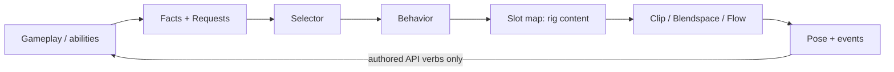
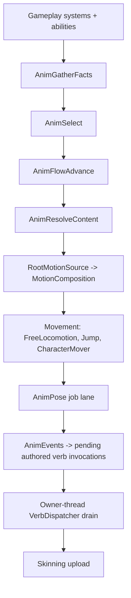

# Sencha Animation Architecture Spec

Date: 2026-09-21. Status: architecture plan of record, updated after the
authored API merge. Implementation is staged by
[animation-authoring.md](animation-authoring.md); this document fixes what the
stages build. It is architectural: it fixes terminology, ownership, data
shapes, control structure and invariants. It does not fix serialization
formats, bone math or job partitioning.

## Scope

Sencha animation is **stateless selection plus explicitly named memory**.
Every animated entity chooses what to play by evaluating data-driven rules
over a snapshot of facts and requests, and the only state the system keeps is
enumerated here, owned by exactly one place, and re-derivable from replicated
gameplay data plus one narrow request record.



The arrows are the only allowed dependency direction. Gameplay learns about
animation solely through verbs emitted at the end of the chain.

## Terminology and ownership boundaries

Temporal memory lives in exactly four places, and each is defined by what it
is allowed to reference, not by what it happens to store.

| Store | Owns | May read | Never contains |
| --- | --- | --- | --- |
| Fact snapshot + fact history | Observable and derived gameplay conditions, including bounded-window history of those conditions | Gameplay components, replication interpolation, its own history | Anything about selection, latches, flows, clips, or pose |
| Request set | Gameplay intent toward animation: identity, start tick, lifetime, layer mask, progress anchor | Written by abilities and by the server flow runner (anchor only) | Which clip plays, blend state |
| Selector state | Selection bookkeeping per layer: winner, previous winner, tick the winner started, latch record, hold and cooldown expiry | Facts, requests, its own previous value | Content ids, clip times, pose data, gameplay values |
| Flow state | Current section, section start tick, loop count for one running flow | Facts and requests at section boundaries | Anything outside its own flow |
| Feedback signals (previous tick) | `ContentComplete` and `SectionEnded` per layer, published by AnimResolveContent and AnimFlowAdvance | Read only by AnimSelect on the following tick | Content ids, times, or anything a fact could express |

The ownership test for a fact provider is executable: a provider must produce
identical values on a server with animation compiled out. If computing a value
requires knowing what is playing, it is selector or flow state, not a fact.
`JustLanded` passes because it is an edge on `Grounded`. `LandClipPlaying`
fails and is forbidden.

The test for selector state is the inverse: it may only record outcomes of
selection. `TimeInBehavior` is legitimate because it is `now - winnerStartTick`.
`TimeSinceGrounded` in selector state is forbidden because it is a fact.

Terms used throughout:

- **Fact**: a typed value in a declared slot, gathered once per tick from
  gameplay or derived from other facts.
- **Request**: a record of gameplay intent with identity and lifetime; the only
  animation-facing data gameplay writes and the only animation-facing data that
  replicates.
- **Selector**: an ordered rule list that maps a snapshot to one behavior per
  layer.
- **Behavior**: an abstract, rig-independent animation intent such as
  `Anim.Locomotion.Sprint`, carrying policy (blend, latch, late-join) but no
  content.
- **Slot map**: a rig-specific table resolving a behavior plus facts to content.
- **Content**: a clip, blendspace, or flow.
- **Flow**: a forward-only section sequence describing how one behavior unfolds
  over time.
- **Layer**: a masked pose stream with its own selector.
- **Verb**: a Sencha authored-API invocation emitted by animation through an
  authored binding. Animation never calls gameplay directly and never stores a
  runtime `VerbId`; this is the only channel from animation back to gameplay.

## Fact schemas and providers

The fact schema is open to games and content; the predicate operations and
derivation operations are closed. That split keeps rule evaluation a fixed
bytecode over fixed slots while letting any game publish new animation-relevant
values without touching engine code.

A fact schema is a data asset listing typed slots. Slot types are `bool`,
`float`, `int`, `tag` (one interned tag), and `tagset` (a reference to a
`CountedGameplayTagSet` on the entity). A rig references one schema; the engine
ships a core schema (`Grounded`, `Speed`, `VerticalSpeed`, `Dead`) and games and
mods extend it by declaring more slots by name. Schemas merge at load into one
fixed layout per rig, and slots are addressed by index in compiled rules and by
name in authored assets.

A provider publishes values into slots. Three kinds exist:

1. **Bound providers**: C++ gameplay code binds a component field or accessor
   to a named slot through a binding table. Adding a new value is a one-line
   binding in game code, not an engine change.
2. **Derived facts**: authored in the schema asset from a closed set of
   derivation ops over other facts: `Edge(fact, rising|falling, holdMs)`,
   `TimeSince(fact, value)`, `Hysteresis(fact, enter, exit)`,
   `MinDuration(fact, ms)`, `Smooth(fact, tau)`, `Compare`, `And`, `Or`, `Not`.
   `JustLanded = Edge(Grounded, rising, 120)`,
   `Airborne = MinDuration(not Grounded, 80)`,
   `TimeSinceGrounded = TimeSince(Grounded, false)`.
3. **Replicated providers**: on clients, remote entities gather facts from the
   interpolated snapshot through the same binding table, so remote and local
   entities share one schema.

Derivation is what keeps the fact layer from becoming a stealth FSM. Derived
facts may reference only other facts, every temporal op has a bounded window
(cap 1000 ms, enforced at cook), and no derivation op can read selector, flow,
or pose state. The result is that fact history is a ring buffer of gameplay
values with a known horizon, and any derived fact is exact after one horizon of
observation. That bound is what late join relies on later.

Slots carry two flags. `local` marks facts that exist only on the rendering
machine (camera facing, quality tier, cosmetic variant seed). `replicated` is
the default and means the value is a function of replicated gameplay state.
Cook validation uses the flag to restrict what local facts may influence.

## Animation requests

A request is gameplay saying "present this intent, starting at this tick, on
these layers, until I say otherwise." It is not a fact, not a command, and not a
clip. The selector reads it like a fact; the rest of the engine treats it as the
one replicated animation-facing record.

```text
AnimRequest
  id         RequestId   (sourceEntity, per-source sequence); the only handle for cancellation
  intent     TagId       e.g. Anim.Reload, Anim.Melee, Anim.Door.Open
  layers     LayerMask   which layers may claim it
  startTick  Tick        server tick the intent began; content time = now - startTick
  lifetime   Held | Fixed(ticks) | Impulse
  params     [4] x 32-bit  named and typed per intent in the request schema; read via ReqParam(intent, name)
  sourceTag  TagId       originating ability; debugging only, never semantic
  anchor     optional {section u8, sectionStartTick Tick}  server-written flow progress
```

**Provenance.** The sourceEntity portion of `RequestId` is the gameplay
participant/entity whose action created the request. For a request-driven
animation event it becomes `VerbInvocationSource::Instigator`. It is provenance
only, never a target and never an authority claim. The animated entity itself
is the event `Producer`. Any gameplay target must travel through the authored
binding as a typed argument.

**Lifetimes.** `Held` lives until the source cancels it; abilities own it and it
is the normal case for reloads, charges, climbs, and doors. `Fixed` expires on
its own at `startTick + ticks` and is the right shape for hit reactions, taunts,
and anything a late joiner should be able to reconstruct without the source
still being alive. `Impulse` is a `Fixed` with zero duration: it is observed for
exactly one tick by the selector, drives edge-style behaviors, and is dropped
from snapshots older than one history horizon.

**Cancellation.** `Cancel(id, reason)` with reasons `Released`, `Interrupted`,
`Failed`, `Superseded`. The reason is visible to the selector through
`ReqCancelReason(intent)` for one tick and is recorded in the decision log. A
new request with the same intent and source supersedes the old one, which is how
a combo advances or a charge updates its param.

**Precedence.** A request has no priority field. All precedence between intents
lives in selector rules, and a conflict between two live requests is resolved by
whichever rule is higher. Removing priority from the record is deliberate: it
stops abilities from negotiating with each other through animation and keeps
the request a statement of intent rather than a bid.

**Params.** A request schema asset declares, per intent, up to four named typed
params (`float`, `int`, `bool`, `tag`), exactly as the fact schema declares
slots. Every `ReqParam(intent, name)` in a rule or slot row is resolved to an
index and type-checked against that declaration at cook. Storage is a fixed
4 x 32-bit block; an intent that needs more than four is exposing gameplay state
and should publish a fact instead.

**Concurrency.** Requests with distinct ids coexist, including the same intent
from different sources. Supersession is scoped to `(sourceEntity, intent)`: a
source replacing its own intent is a combo advancing; two attackers each issuing
`Anim.HitReact` are two records. `ReqActive(intent)` is true if any record
matches; `ReqAge`, `ReqParam`, and `ReqCancelReason` bind to the **primary
record** for that intent, defined as newest `startTick` with ties broken by id
ordering, so every machine picks the same one. An `Impulse` is deduplicated per
`(sourceEntity, intent, tick)` and never supersedes anything.

**Capacity.** The set holds 8 records. Expired `Fixed` and `Impulse` records are
removed before any insert. On overflow the new request is rejected, the caller
receives a failure, and a `RequestRejected(Capacity)` decision record is written;
nothing is evicted, so the outcome is deterministic on server and client alike.
Cook warns for a rig whose declared intents could plausibly exceed 8
concurrently.

**Non-goals.** A request has no target entity, no handler, no reply, and no
payload dispatch. Anything that looks like sending a message to gameplay through
a request is a verb travelling the wrong direction.

**Consumption.** A request that no rule on any of its masked layers claims is
not an error at runtime; the debugger reports it as unclaimed so missing content
is visible.

**Boundary rule.** Requests are not gameplay commands. An ability that wants
ammo to change or a hit to land does that itself, on its own timer, in the
simulation-authority World. The request exists so that animation can choose and
time presentation; it never gates or triggers authoritative gameplay. The one
thing gameplay may consume in return is authored-API verb invocations,
described later.

Requests live in their own fixed-capacity component, `AnimRequestSet`, not
inside `AnimFacts`, because they have identity and lifetime that facts do not.

## Selectors and compiled predicates

A selector is an ordered rule list compiled to a flat bytecode program;
evaluation is first-match by priority with one concession to memory, a per-rule
stay predicate.

```text
Rule
  priority  i16
  enter     predicate  evaluated when this rule is not the current winner
  stay      predicate  evaluated only while this rule is the winner; defaults to enter
  result    Behavior(tag) | Delegate(selector) | LayerWeight(float expr)
  holdMin   ms         winner cannot be replaced by a lower-or-equal band before this elapses
  cooldown  ms         rule cannot re-win within this time of losing
```

`stay` is the only place hysteresis is authored. `enter: Speed > 2.2,
stay: Speed > 1.8` is a complete stop to boundary flicker without a transition.
It references only the rule itself, never another rule, so it is not an edge in
disguise.

Forms that are rejected by construction, because the bytecode has no operand
type for them: `stay unless <rule>`, `exit when <behavior>`,
`on transition from <X>`, or any predicate naming a rule, a behavior, or the
previous winner. Adding such an operand is an architecture change, not a
feature request.

**Evaluation per layer per tick.** If the current winner is latched (see
Latches), its stay is the latch condition. Otherwise evaluate the winner's
`stay`; if it passes, evaluate `enter` for every higher-priority rule and the
first pass wins. If `stay` fails, evaluate `enter` top to bottom and the first
pass wins. `holdMin` and `cooldown` are checked as part of `enter`. A rule that
evaluates but is not chosen is recorded with the index of its first failing op,
which is what the debugger displays as the reason.

**Bytecode.** A stack machine with a closed op set: `PushSlot(slot)`,
`PushConst`, `Lt Le Gt Ge Eq Ne`, `And Or Not`, `TagAll TagAny TagNone`
(queryId, hierarchical) over a tagset slot, `ReqActive(intent, layer)`,
`ReqAge(intent)`, `ReqParam(intent, i)`, `ReqCancelReason(intent)`,
`TimeInBehavior`. Extensibility is by adding fact slots, never ops. Programs are
SoA-friendly: one instruction stream per selector asset shared by every entity
using it, evaluated over each entity's `AnimFacts` chunk without indirection or
virtual calls.

**Delegation.** `Delegate(selector)` lets a rule hand off to a nested selector
(weapon-specific, stance-specific, mod-provided). Nesting is flattened at
compile time: the child's rules become rules of the parent with
`parentEnter AND childEnter` and lexicographic priority. Runtime evaluation
stays flat and stateless; the debugger keeps a source map so it can show the
tree. Depth is capped at 4 at cook.

**Extension points.** A selector may declare a named
`Delegate(ExtensionPoint name)` slot with no child bound. Games and mods bind a
selector to that name by data, which is how a mod adds a new weapon's rules
without editing the base selector.

Selectors reference behaviors by tag only. A selector asset that names a clip,
blendspace, or flow fails cook.

## Behaviors and slot resolution

The behavior is the architectural boundary between shared logic and
rig-specific content. Everything above it (facts, requests, selectors) is
reusable across games and rigs; everything below it (slot maps, clips,
blendspaces, flows) belongs to one rig and can be swapped by a mod without
touching a rule.

A behavior is an interned tag (`Anim.Locomotion.Sprint`, `Anim.Action.Reload`,
`Anim.Door.Open`) plus a policy record in a behavior-set asset:

```text
Behavior
  kind        Cyclic | OneShot | Flow | Hold
  blend       BlendPolicy          see Blend policies
  latch       LatchPolicy          see Latches
  lateJoin    Skip | SnapToEnd | Reconstruct
  syncGroup   TagId | none
  rootMotion  bool                 requires request anchoring; validated at cook
  events      weight threshold for cosmetic event firing
```

`Hold` is a cyclic pose that rests at a frame (open door, dead body, aiming
idle). `Reconstruct` is permitted only for behaviors that can be reached solely
through requests; the cook rejects it otherwise, because only requests carry a
start tick.

**Slot map** is a per-rig asset of ordered rows. Each row is a behavior tag, a
small compiled predicate over facts (same bytecode as selectors), and a content
reference. Resolution is first-match, memoryless, and runs every tick after
selection; content can therefore switch under a stable behavior without a winner
change, which is how `Anim.Action.Reload` becomes `reload_shotgun` when
`WeaponType` is a shotgun and `reload_pistol` otherwise, and how a
`Locomotion.Move` blendspace differs by stance.

Whether a row change applies mid-behavior depends on content kind. Cyclic and
Hold content applies a new row immediately, with normalized time carried across
and the discontinuity absorbed by the behavior's in policy; this is the
stance-change and weapon-swap case. OneShot content is pinned at behavior entry
and row changes are ignored until the latch releases. Flow content pins the flow
asset at entry; a section that references a slot resolves at section entry and
is pinned for that section. Resolution therefore runs every tick, but
`AnimContentState` decides by kind whether the result is applied. A pinned
content id whose row no longer exists after a hot reload forces re-resolution
and writes an `Anchored` decision record.

Rows may read local facts (cosmetic variant seed, quality tier) only when every
candidate row for that behavior shares identical duration, section layout, and
gameplay event track. Cook enforces this so that content chosen locally can
never desynchronize timing that the server or another client depends on.

A rig may layer slot maps: a base map plus overlays applied in order (game
overlay, mod overlay, per-character overlay). Overlay rows are inserted by
priority, never by editing base rows, so a mod adds content without forking the
rig asset.

Two consequences fall out of this boundary. A boomer-shooter enemy, a
third-person player, and a Loss Function multiplayer avatar can share one
locomotion selector and differ entirely in slot maps. And the debugger can
always name both halves of a decision: which rule won and which row resolved it.

## Blend policies and inertialization

Transitions are not authored. A winner change on a layer produces a pose
discontinuity, and the behavior that won declares how that discontinuity is
absorbed.

```text
BlendPolicy
  in     Inertialize(ms, curve) | Crossfade(ms, curve) | Snap
  out    Crossfade(ms) only; ignored for Inertialize and Snap
  phase  Reset | Carry(syncGroup)
```

**Inertialization is the default.** At the tick of a winner change the
evaluator samples the outgoing pose once more, records per-bone position,
rotation, and velocity deltas against the incoming pose, and decays them to zero
over `in.ms` with a quintic curve. Nothing from the old behavior stays alive: no
source clip, no transition node, no second sample per tick. Stacked changes
inside one decay window fold into the current delta. The same mechanism absorbs
corrections when reconciliation or a snapshot moves facts underneath a remote or
predicted entity.

**Crossfade** exists for cyclic content that must keep phase, such as walk to
run. `phase: Carry(syncGroup)` aligns normalized time between clips in the same
sync group and blendspace samples inside one group are always phase-locked.
Crossfade keeps the outgoing clip alive for `out.ms` and is the only case where
two clips sample on one layer.

**Pairwise overrides** are a separate per-rig asset, `BlendOverrides`, keyed by
`(fromBehavior, toBehavior)` and holding a `BlendPolicy`. They exist for the
sprint-to-slide or fall-to-land cases where a specific pair wants a shorter or
longer blend. Three constraints keep them rare: an override may change only
blend policy and never selection or content; the asset holds at most 16 entries
per rig by default (cvar-raisable, but the content-risk dashboard reports the
count); and the cook warns at 8. If a rig needs more than that, the fix is a new
behavior or a fact, not another override.

**Layer blending** is separate from winner blending. Each layer composes into
the final pose by its mask and mode (override or additive) at its weight;
inertialization runs inside a layer before composition, so a base-layer winner
change never disturbs an upper-body flow.

## Latches

A latch extends a winner's stay; it never chooses a winner. That single sentence
is what keeps one-shots from becoming states with transitions.

```text
LatchPolicy
  mode             None | UntilComplete | UntilRequestEnds
  interruptibleBy  PriorityAtLeast(band) | Tags(set) | Never
  onInterrupt      Abort | CancelSection   (CancelSection only for Flow behaviors)
  onRequestCancel  Finish | Abort | CancelSection
```

When a behavior with `mode != None` wins, selector state records
`{behavior, startTick, interrupted: false}`. While the latch holds, the layer's
effective stay is "content not complete and not interrupted", and
higher-priority rules may pre-empt only if they satisfy `interruptibleBy`. Death
is `PriorityAtLeast(100)` on almost everything; a full-body reload is
interruptible by jump and death but not by walk.

`UntilComplete` releases when the clip or flow reaches its end; the land clip
triggered by the one-tick `JustLanded` edge keeps winning until it finishes even
though the edge is gone. `UntilRequestEnds` releases when the request is
cancelled or expires and applies `onRequestCancel`; a Held charge request with
`Finish` plays out its release section before yielding.

`UntilComplete` depends on a downstream signal, and that dependency is bounded
explicitly. AnimResolveContent and AnimFlowAdvance publish two per-layer
feedback signals at the end of each tick, `ContentComplete` and `SectionEnded`,
and AnimSelect on the next tick reads them as inputs beside facts and requests.
They are not facts, since they cannot be computed with animation compiled out,
and selector state never stores them or any content id; the latch record is only
`{behavior, startTick, interrupted}`. This is the one read against the
dependency arrow, it is always one tick late, and it keeps system ordering
acyclic.

Latch state is reconstructible by construction: it is a function of the request
set history, the fact history, and `now - startTick`. Fact-triggered latches
(edge facts) have no replicated start tick, so they are cosmetic-only and their
behaviors must use `lateJoin: Skip` or `SnapToEnd`. Request-triggered latches
carry the request's tick and may use `Reconstruct`. Cook enforces this pairing.

## Local flows

A flow is a forward-only sequence of sections with one cancel section. The
constraint was tested against the six representative cases below and each fits;
where a case looked like it needed branching, the branch turned out to belong to
gameplay.

```text
Flow
  sections[]  ordered
  cancel      section index (usually last-ish: "abort" or "exit")
Section
  content       clip | slot ref (resolved through the slot map)
  loop          Once | While(predicate) | Count(ReqParam)
  next          default: index + 1
  branches[]    (predicate -> later section) evaluated only when the section ends
  cancelTiming  Immediate | AtSectionEnd
  verbs         Flow.Section.Entered / Exited emitted with section tag
```

Allowed control: advance to the next section, loop on the current section, jump
forward at a section boundary, or go to the cancel section. Backward jumps,
jumps mid-section other than to cancel, and any predicate evaluated mid-section
other than the loop condition are rejected at cook.

| Case | Shape under the constraint | What lives in gameplay instead |
| --- | --- | --- |
| Pump shotgun reload | `enter -> insert (While: ammo < max and request held) -> exit`; fire is a higher-priority request that interrupts with Immediate cancel to exit | Ammo count, whether firing is legal mid-reload |
| Melee combo | One flow per attack: `swing -> window -> recover`; on `Flow.Section.Entered window` gameplay may issue a superseding `Anim.Melee` request with `params[combo]`, and the slot map resolves the next swing | Combo counter, input buffering, whether the chain continues |
| Charge attack | `windup -> hold (While: request held) -> release -> recover`; early release before windup ends branches forward to release at the boundary; `params[charge]` picks the release variant by slot row | Charge accumulation, damage |
| Draw, fire, recover | Draw is a flow behind `Anim.Weapon.Draw`; fire is a separate OneShot behavior on the upper layer; draw latch is `interruptibleBy Never` and gameplay refuses fire until the draw request ends | Whether firing is permitted |
| Ledge climb | `grab -> pull -> mantle`; abort by `Cancel(Released)` and failure by `Cancel(Failed)` both route to the drop cancel section; motion is a movement mode, animation follows it | Ledge validity, the capsule's motion |
| Door or machinery | `Anim.Door.Open` is a Fixed request that plays opening; the rested pose is a Hold behavior selected by the `DoorOpen` fact, so a late joiner resolves the correct state from the fact alone | The door's open/closed state, locks, timers |

The pattern in the right-hand column is the actual rule: a flow never decides
anything. When a sequence needs a decision, the flow reports a section boundary
as a verb and gameplay responds with a new or superseding request. Flow state is
therefore exactly `{section, sectionStartTick, loopCount}` and nothing else.

## Layers and masks

A rig declares a fixed, ordered list of layers, each with its own selector,
mask, and compositing mode; there is no global animation state above the layers.

```text
Layer
  name      TagId          Anim.Layer.Base, Anim.Layer.Upper, Anim.Layer.Aim
  mask      bone set       authored per rig; Base is unmasked
  mode      Override | Additive
  selector  selector ref   may be absent (see minimal path)
  weight    LayerWeight rule output, or constant
```

Layers compose in declared order into the final pose. Requests carry a layer
mask, so one `Anim.Reload` request can be claimed by an upper-body rule while
base locomotion continues, and a base rule can also claim it under
`Speed < epsilon` to play the full-body variant, at which point the upper rule
sees it as already fully covered because layer weight for Upper drops to zero.
Weight is a rule output so the aim additive can fade in on
`ReqActive(Anim.Aim)` and out otherwise without a state.

The cap is 8 layers per rig, fixed at compile so per-entity selector and content
state are SoA arrays of known size. Facial and equipment layers are ordinary
layers with small masks and small selectors; they carry no special machinery.

## Event tracks and verbs

Animation events are timeline marks that produce invocations through Sencha's
existing authored API. Animation says when and supplies event-local inputs; the
authored binding says which verb contract those values feed; gameplay owns the
implementation and the resulting state change. Event tracks never contain a
direct callback, a runtime `VerbId`, or a numeric gameplay-tag id.

```text
Event
  time       normalized clip time
  binding    authored binding key text; resolved per World through VerbBindingSet
  inputs     up to 4 named typed producer values for that binding
  scope      Cosmetic | Gameplay
  minWeight  float (Cosmetic only); do not produce below this layer or blend weight
```

The binding is the same `authored.bindings` mechanism used by UI and level
relays. The authored track stores the binding key, not the target verb's runtime
identity. At load/refresh the World's `VerbBindingSet` resolves that key to a
`CompiledVerbBinding` against the live `VerbRegistry`. Constants, asset
references, entity references, tag resolution, argument contracts, and any
mapping from one producer input to several verb arguments remain properties of
the binding. The event track supplies only its declared dynamic inputs. Runtime
code must not cache a raw pointer to a compiled binding across binding-set
revisions or hot reload.

Event inputs use the authored API's value kinds and are checked against the
binding's compiled input destinations before dispatch. The animation-side cap
remains four event-provided values; that is a content budget, not a second
argument-schema language. If an event appears to need a large payload, the
missing information belongs in gameplay state, a fact, or a more appropriate
binding constant.

Firing eligibility and gameplay authority are separate facts:

- **Cosmetic** events are produced on whichever rendering machine evaluates that
  pose: the predicted client for the local pawn and clients presenting remote
  entities. A headless authority does not run them.
- **Gameplay** events are produced only in a World with `SimulationAuthority` —
  standalone or host/server — and never by a non-authority client. This prevents
  a client pose from originating an authoritative effect, but the scope itself
  is not an authority claim. A mutating verb implementation still checks
  `IsSimulationAuthority(world)` and validates the invocation's instigator
  against gameplay/session ownership exactly as it would for any other producer.

AnimEvents may run after pose work on a client or from timing/content
advancement on an authority that does not pose. It does not call
`VerbDispatcher` from a worker job. It publishes fixed-size pending event
invocations into the existing owner-thread drain. That drain resolves the
binding by key/revision and performs the normal call:

```text
VerbDispatcher::Invoke(compiledBinding, eventInputs, source)
```

`VerbInvocationSource` is populated as follows:

- `Producer` = animated entity that crossed the event mark
- `Instigator` = request sourceEntity for request-driven behavior; otherwise
  empty unless the producer has an unambiguous local gameplay instigator
- `Tick` = fixed simulation tick in which the event mark was crossed
- `Parent` = local parent `InvocationId` when a real causality link is still
  available; otherwise 0

Producer and Instigator are attribution only. Neither is implicitly the
operation's target. Targets are typed arguments declared by the verb contract
and filled by the authored binding. The drain records the resulting
`VerbAdmission` in `AnimDecisionLog`, so unresolved, stale, unavailable,
invalid, refused, queue-full, and accepted events are visible rather than
silently lost.

Firing is once per clip instance per event, tracked against the time range
advanced this tick. A time skip (late join, a request re-anchored by the server,
a Reconstruct) marks skipped events as Skipped in the decision log and does not
produce them; the one exception is a Gameplay event on the simulation authority,
which cannot be skipped because the authority is never the machine catching up
from replicated animation state.

Flows emit the lifecycle events `Flow.Section.Entered` and
`Flow.Section.Exited` with the section tag, and latches emit `Behavior.Entered`
and `Behavior.Exited`. These use engine-provided authored binding keys resolved
through the same `VerbBindingSet`; they do not bypass the authored API with a
special callback path. These lifecycle verbs are the ordinary way gameplay
observes animation progress. Nothing else in animation state is readable from
gameplay.

Gameplay-scope events are permitted but discouraged. If an ability's
authoritative timing can be expressed as its own fixed-tick offset, do that and
keep the animation event Cosmetic. Use Gameplay scope only where authored timing
must match content that can legitimately vary by rig while still passing the
event-track equivalence validation described in this spec.

## Authoritative and server execution

A World with `SimulationAuthority` runs the authoritative decision/timing half
of the pipeline. In a networked session this is the host/server; in standalone
play it is the standalone World. A headless authority normally skips the pose
half. Each animated entity has an animation participation tier, aligned with the
existing participation LOD tiers:

| Tier | Runs on server | Used for |
| --- | --- | --- |
| None | Nothing | Props with only cosmetic content and no root motion |
| Timing | GatherFacts, Select, FlowAdvance, ResolveContent, Gameplay-scope event tracks, root-motion curves | Anything with Gameplay events, flows gameplay observes, or root motion |
| Full | Timing plus pose evaluation | Listen servers and server-side hit volumes driven by pose, if ever needed |

The authority needs ResolveContent because event tracks and root curves belong
to clips, but resolution is a table lookup and costs nothing like sampling.
Because local facts cannot change duration, section layout, or Gameplay event
tracks, the authority's resolved content agrees with every client's on
everything that matters, even when clips differ cosmetically.

The simulation authority is also the only writer of a request's progress anchor.
In a networked session the host/server stamps `{section, sectionStartTick}` when
its flow runner crosses a section boundary or enters the cancel section, and
that stamp replicates with the request. Nothing else in animation is written by
the authority on behalf of clients.

## Replication, prediction, reconciliation, late join

The corrected claim is: nothing in animation replicates except the request
record, and the request record carries one server-written progress anchor.
Everything else is derived, and the table shows from what.

| State | Derived from | Guarantee |
| --- | --- | --- |
| Fact snapshot | Replicated gameplay components, interpolated for remote entities | Exact once the entity is replicated |
| Derived and edge facts | Fact history, bounded window (cap 1000 ms) | Exact after one window; edges inside the window before join are lost by design |
| Winner per layer | Snapshot, request set, selector state | Pure function; never sent |
| Fact-triggered latch (land, hit flinch by edge) | Edge fact plus local time | Cosmetic; `lateJoin: Skip` or `SnapToEnd`; a late joiner may miss a short one-shot and that is accepted |
| Request-triggered latch | Request `startTick`, lifetime, cancel history | Reconstructible: `TimeInBehavior = now - startTick` |
| Flow section for a flow with only Once sections and forward branches on replicated facts | Request `startTick` plus content durations | Reconstructible by walking sections |
| Flow section for a flow with While or Count loops, or after an interruption | Request anchor `{section, sectionStartTick}` | Reconstructible because the server stamps the anchor; this is the one narrow sync mechanism |
| Resolved content | Behavior plus facts through the slot map | Deterministic on replicated facts; local facts restricted by cook |
| Blend and inertialization state | Local pose history | Never sent; corrections are absorbed, not synchronized |

**Predicted pawn.** Animation runs on predicted facts every tick.
Reconciliation replays inputs through the movement pipeline only; animation is
not rewound and fact history is not rewound. A corrected snapshot changes facts
on the next gather, which may change a winner, and inertialization absorbs the
pop. A mispredicted landing may fire a land one-shot that the server never saw;
it is cosmetic, so this is accepted. Requests issued by predicted abilities are
predicted like any other ability state and reconciled by the ability system, not
by animation.

**Remote entities.** Facts come from interpolation, requests from the snapshot.
A request arriving with a `startTick` in the past starts at offset
`now - startTick`; if it carries an anchor, the flow starts at the anchored
section at offset `now - sectionStartTick`. Any resulting discontinuity is
inertialized.

**Late join.** The joiner receives current gameplay state and the live request
set with anchors. Fact-only behaviors resolve immediately (dead body via `Dead`,
open door via `DoorOpen`). Request-driven behaviors reconstruct from tick and
anchor. Fact-triggered one-shots either skip or snap to end per their policy.
Events inside the caught-up range are marked Skipped.

**What the anchor costs and why it is worth it.** Roughly three bytes per active
Held request, only on flows with loops or after interruption, written by the
server that is already running the flow. The alternative is replicating
ammo-insert counts, combo indices, and interruption ticks as bespoke gameplay
state purely so animation can recover them, which contorts gameplay replication
to preserve a slogan. The anchor is the explicit mechanism instead.

**As built (2026-09-24).** The request set travels as a translated image:
sources as `NetEntityId`, intents, source tags and tag params as tag wire keys.
Records mark their tag-kind params (`TagParams`) from the rig's request schema.
A client counts content time on the authority's ticks through
`SimulationAuthority::TickOffset`, which the engine publishes from its clock
estimate. What the paired tests and the editor's session lab showed had to be
added:

- A machine that joins during a cancelled request's tail adopts the request
  when its tail runs past the cancel tick. Without that it idles through
  the tail.
- A machine that follows the authority moves a playing flow to the anchor when
  the anchor names the current section with another entry tick, or names
  another section entered no earlier. A cancel heard a flight late otherwise
  plays its whole section late.
- The same request arriving with another start restarts pinned content there
  (`RequestCorrected`).
- A prediction the authority decides otherwise marks the entity for
  reconstruction. The next pass starts selection over and rebuilds its
  request-driven layers from the authority's requests and anchors, as a joiner
  would (`Reconstructed`). Latches resting on the guess would otherwise outlive
  it.
- `AnimRequestJournal` is the narrow gameplay-owned prediction path. Its
  predictions are marked local-only, re-issued on top of every arriving set
  until the authority processes their command, then taken down if refused.
- `AnimRigTimingIdentity` names, by portable names, everything reconstruction
  depends on and nothing cosmetic. The authority stamps it on the set, and a
  client that binds the rig differently records `TimingDisagreed`.

Nothing is rewound.

**Invariant made concrete.** A behavior may declare `lateJoin: Reconstruct` only
if every path that can select it passes through a request, and a flow may use
While or Count loops or Immediate cancels only under a request-driven behavior.
Cook checks both by walking the selector for each behavior and confirming
`ReqActive` appears in every winning path.

## Root motion and motion sources

Root motion is a motion source for `MotionComposition`, not an animation
feature, and animation never moves the capsule.

At cook, each clip's root track is extracted into a separate `RootCurve` asset
(translation and yaw over normalized time) and stripped from the pose data. A
behavior flagged `rootMotion` registers a `RootMotionSource` with
`MotionComposition` for the entity while it is the winner on the Base layer; the
source samples the curve at the current content time and contributes
displacement like any other source, and `CharacterMover` and Jolt resolve it
against the world.

Because the curve is data and the content time is `now - startTick` of a
request, root motion is deterministic and replayable through prediction:
reconciliation re-evaluates the source during input replay exactly as it
re-evaluates FreeLocomotion and Jump. That is why rootMotion behaviors must be
request-driven (cook enforced) and why the server can run them at the Timing
tier without posing. Fact-triggered behaviors cannot carry root motion.

**As built (2026-09-24).** The curve is extracted at cook into the clip itself
(`.sanim` v3), not a separate `RootCurve` asset: nothing needs a curve without
its clip, and a second asset kind would add a loader and cache with no
consumer. Extraction is opt-in per clip in the source's sidecar. Movement has
no motion-source objects, so the seam is a World resource,
`RootMotionSource`, whose sampler animation installs. `RootMotionSystem`
(between the action producers and composition) and `StepCharacterTick` (the
replay kernel) ask it for the same tick, so a replay is carried as the live
tick was. The sample replaces the planar channel and adds a turn channel;
gravity and jumping keep the up channel, and the mover turns the transform. A
body whose facing `AimFacing` owns keeps its look yaw. On a request-keyed base
layer the carrier is derived from the request records' own start and cancel
ticks, so a replay after a cancel or a corrected start re-evaluates. A
selector's base layer is carried by what it plays now. Replay maps each
command tick to the animation clock with the offset between the clock
estimate and the command lead.

For predicted pawns the recommended split remains: ordinary locomotion is
capsule-driven with animation following, and root motion is reserved for
authored moves (mantles, finishers, scripted interactions) where the movement
pipeline enters a mode that yields to the source. Which moves take which path is
a movement-data decision, not an animation one.

## ECS components and system ordering

Animation state is a handful of fixed-size components, and an entity's tier is
simply which of them it carries; there is no animation object and no per-entity
heap.

| Component | Contents | Present on |
| --- | --- | --- |
| `AnimRig` | Handle to the rig asset (schema, layers, selectors, slot map, blend overrides) | All |
| `AnimRequestSet` | Fixed 8 `AnimRequest` records | All |
| `AnimFacts` | Fixed-slot values; two capacity tiers (Small 16 slots, Large 64) chosen per rig | Simple, Character |
| `AnimFactHistory` | Ring of the slots referenced by derived facts, sized to the schema's max window | Only if the schema has temporal derivations |
| `AnimSelectorState` | Per layer: winner rule, previous rule, winner start tick, latch record, hold and cooldown expiry | Simple, Character |
| `AnimFlowState` | Per layer: section, section start tick, loop count | Character, or any rig with flows |
| `AnimContentState` | Per layer: resolved content id, slot row, content time, blendspace coordinates | All |
| `AnimPoseState` | Per layer inertialization delta buffer, crossfade residue | Client Full tier only |
| `AnimDecisionLog` | Ring of decision records | Dev builds, or opted in by cvar per entity |
| `SkinnedMesh` | Existing | Client |

All rule programs, slot maps, and policies are immutable shared assets
referenced through `AnimRig`, so evaluation is a job over chunks with no pointer
chasing beyond the asset handle. `Changed<AnimFacts>` and
`Changed<AnimRequestSet>` gate AnimSelect so idle entities skip evaluation;
content time still advances.

Selection runs before movement so root motion can contribute, and posing runs
after movement so the pose reflects the resolved position. Facts are therefore
one tick behind movement, which is the standard trade and avoids a cycle.



A simulation-authority World runs A through F and the Gameplay-scope AnimEvents
path even when it skips H and J. A headless authority consumes the time range
advanced by AnimFlowAdvance and AnimResolveContent rather than the pose pass.
`VerbDispatcher` itself remains owner-thread only: animation jobs publish
pending invocations to the existing drain and never dispatch directly.

## Debugging and decision history

Every winner change, latch decision, section change, and content change writes
one decision record, and a record with no cause is a bug. The log is part of the
architecture because the invariants below are only enforceable if every state
change is attributable.

```text
DecisionRecord
  tick, layer
  cause       FactsChanged(slots[]) | RequestAdded(id) | RequestCancelled(id, reason)
              | HoldExpired | LatchComplete | LatchInterrupted(by rule) | SectionEnded | Anchored
  candidates  rule index, pass/fail, first failing op, operand values at that op
  winner      rule index, behavior tag, stayed | changed
  latch       none | armed | held | released(reason)
  flow        section before -> after, branch or cancel taken, loop count
  content     slot row index, content id, content time
  blend       Inertialize(ms, delta magnitude) | Crossfade | Snap | override applied (from, to)
  events      binding key, resolved verb, scope, admission, fired | skipped | belowWeight
```

The live inspector shows the current snapshot in the order the user asked for:
active selector, winner, candidates with predicate results, facts, active
requests with anchors, layers and weights, resolved content and normalized time,
emitted events, flow section. The history view shows the ring buffer for a
frozen entity with scrubbing, so a flicker three seconds ago is a row with its
cause and the fact values at that tick.

Capture is per entity via `anim_trace <entity>` in the dev console, with a
global cvar for ring depth; dev builds keep a short ring on every
Character-tier entity. Records can be exported for attaching to a bug.

The content-risk dashboard gains animation counters: blend overrides per rig,
selector rule counts, flattened selector depth, flows with more than 8 sections,
unclaimed requests observed at runtime, and behaviors reachable both by fact and
by request. Each of these is a leading indicator of the design regressing
toward a graph.

## Asset and modding model

Every animation asset references other things by name, ids are interned at
load, and mods extend by overlay rather than by editing base assets. Event
tracks follow the same rule: they store authored verb binding keys, never
runtime `VerbId`s or pointers to compiled bindings. The World-local
`VerbBindingSet` is the sole bridge from those names to executable authored API
operations and owns refresh across catalog, vocabulary, and asset changes.

| Asset | Owns | Extensible by |
| --- | --- | --- |
| Fact schema | Slot declarations, derived facts | Games and mods append slots and derivations by name |
| Behavior set | Behavior tags and policies | Mods add behaviors; base policies may be overridden by tag |
| Selector | Rules, delegations, extension points | Mods bind selectors to extension points; base rules untouched |
| Slot map | Behavior to content rows | Overlays inserted by priority |
| Blend overrides | Pairwise policies | Overlays, capped and reported |
| Flow | Sections and cancel | Mods supply new flows referenced by slot rows |
| Rig | Layers, masks, schema ref, selector per layer, slot map stack | Per-character overrides of slot map and overrides only |
| Clip, blendspace | Cooked pose data, event track, root curve | Mods ship their own |

Gameplay tag ids are registration-order dependent and runtime-only, so no
compiled rule or slot map ever stores a numeric tag id; compilation to slot and
tag indices happens at load against the live registry, and the cooked form
stores names. Hot reload uses the existing slot-swap path: a changed selector or
slot map recompiles and replaces the shared asset, and per-entity state survives
because it holds only indices that the recompile remaps or, if the rule set
changed shape, resets with an `Anchored` decision record.

Cook validation is where most of the invariants below are enforced: predicate op
set, derivation windows, delegation depth, local fact restrictions on slot rows,
latch and late-join pairing, root-motion request anchoring, flow control
structure, override caps, and event binding input compatibility. Binding
availability itself remains a World/runtime fact: an editor may resolve a
declared verb catalog without having an executable implementation bound behind
it.

## Minimal path versus full character path

Tier is decided by which components an entity carries, and the cheapest tier has
no selector at all.

**Prop tier** (door, platform, pickup, machinery): `AnimRig` with one layer and
no selector, `AnimRequestSet`, `AnimContentState`. The rig's slot map is keyed
directly by request intent, so `Anim.Door.Open` resolves to a clip or a
two-section flow and the absence of requests resolves to a default Hold. No
facts, no selector state, no pose state; blends are Snap or a short Crossfade. A
door's open state is a gameplay fact only if something else needs it, and if it
is, the rig may add a single-slot `AnimFacts` to select the rested pose by fact.

**Simple tier** (Quake-style monster, first-person weapon view model, Loss
Function enemies): one layer, one selector of six to ten rules, Small facts, no
flows, Timing tier on the simulation authority only if it has Gameplay events.
This is the expected default for most of Loss Function and the boomer shooter.
The original claim that its per-entity state is under 100 bytes does not hold
for the complete component set (an 8-record request set alone exceeds it); the
implementation measures and reports actual footprints instead.

**Character tier** (third-person player, SINR protagonist, multiplayer
avatars): multiple layers, delegated selectors, Large facts with history, flows,
latches, inertialization, decision log in dev. Nothing in this tier is required
by the lower tiers, and nothing in the lower tiers is a special case; a Simple
entity is a Character with fewer components.

The engine ships preset rigs for each tier so a new entity type starts from one
file, and the design principle from the rest of Sencha holds: genre and
complexity enter as defaults and budgets on the same mechanism, never as a
separate system.

## Invariants

These are the conditions under which the design remains stateless selection
plus named memory. Each is either enforced at cook or observable in the decision
log; a proposed change that violates one is a change to the architecture, not to
content.

1. Selection on a layer is a pure function of the fact snapshot, the request
   set, the previous tick's feedback signals, and that layer's selector state.
   Selector state holds only selection outcomes, never gameplay values, content
   ids, or pose data.
2. No rule references another rule, a behavior, a previous winner, or a
   transition source. The only self-reference is a rule's own stay predicate,
   and the bytecode has no operand type that could name any of the others.
3. Every fact is computable with animation compiled out. A provider that would
   need to know what is playing is not a provider.
4. Derived facts use closed derivation ops over other facts with bounded
   windows. No derivation reads selector, flow, or pose state.
5. Predicate and derivation op sets are closed. Extensibility is by adding fact
   slots, request params, behaviors, selectors bound to extension points, and
   slot map rows.
6. Selectors reference behaviors; only slot maps reference content. A selector
   that names a clip fails cook.
7. Blend policy is a property of the destination behavior. Pairwise overrides
   change blend policy only, are capped per rig, and are reported as content
   risk.
8. A latch extends a winner's stay; it never selects a winner and never
   references content.
9. Flows are forward-only: advance, loop on the current section, branch forward
   at a section boundary, or go to the single cancel section. Flows read facts
   and requests and write nothing.
10. Flows decide nothing. A decision inside a sequence is an authored-API verb
    invocation out and a request in.
11. The request record is the only animation-facing data that replicates, and
    its progress anchor is written only by the server.
12. Any behavior reachable without a request is cosmetic: no Reconstruct, no
    root motion, no Gameplay events, no loops or immediate cancels in its flow.
13. Slot rows that read local facts may only choose between content with
    identical duration, section layout, and gameplay event track.
14. Gameplay never reads animation state. It receives authored-API verb
    invocations, and Gameplay-scope producers run only in a World with
    `SimulationAuthority`.
15. Root motion is a motion source composed by `MotionComposition`, never a
    direct write to the capsule.
16. Every state change on a layer produces a decision record with a cause. An
    unattributed change is a bug.
17. Tier is component presence. No lower tier depends on any Character-tier
    mechanism.
18. Content resolution applies by kind: OneShot and Flow content is pinned at
    entry; only Cyclic and Hold content may change under a stable behavior.
19. The only reads against the dependency direction are the previous tick's
    `ContentComplete` and `SectionEnded` feedback signals, and they are never
    facts.
20. Requests carry no priority and no target. Precedence lives in rules; effects
    travel through authored verb bindings.
21. Event tracks author binding keys plus producer inputs. They never store
    runtime `VerbId`s, direct callbacks, or raw pointers to compiled bindings.
    Binding compilation and refresh are World-local and owned by
    `VerbBindingSet`.
22. Authored API attribution never substitutes for gameplay semantics: the
    animated entity is Producer, request provenance supplies Instigator, an
    operation target is an explicit typed argument, and mutating operations
    still enforce `SimulationAuthority`.

The honest limit: this is still a system with memory, and the memory is
enumerable: fact history, request set with anchors, selector state, flow state,
pose residue. The difference from an FSM is not the absence of state but that
every piece of it has one owner, one derivation, and one place in the log.
