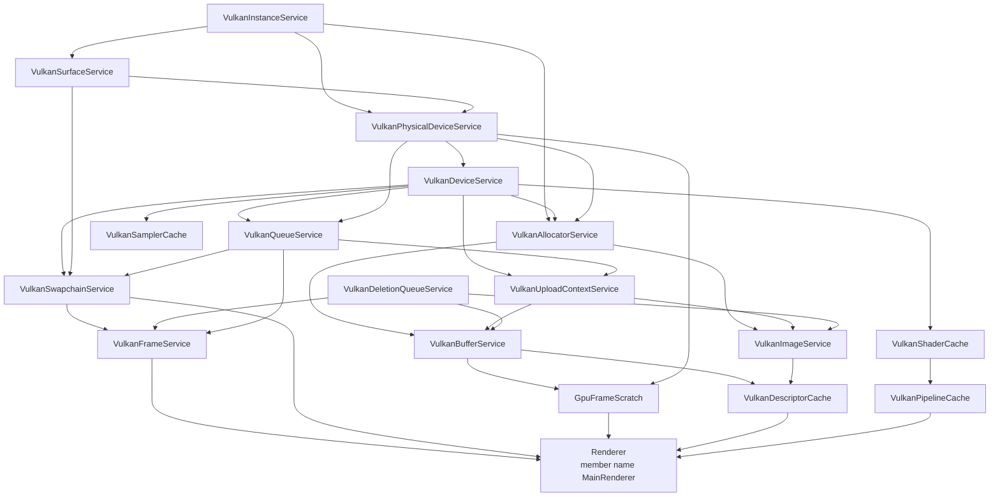
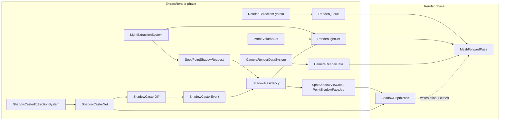

# Architecture and Topology

## The two halves

The render layer is split into a scene-facing half and a backend half, and the
split is enforced by directory and by include direction.

```
render/            scene-facing. Knows ECS, components, math, asset caches.
                   Names no graphics API at all, except in render/pass/.

render/pass/       the recording set. The one surface that turns render-domain
                   state into device commands, and the one that a second
                   backend would twin. Closed: three passes, by contract.

graphics/          the neutral shelf. Handles, descriptions, extents, the
                   frame contract -- what both halves may name.

graphics/vulkan/   backend. Knows Vulkan, the platform surface, and logging.
                   Knows nothing about ECS, zones, components, or gameplay.
```

`graphics/RenderFeature.h` is the header both halves include: it declares
`RenderPhase`, `IRenderFeature`, and the two structs a feature is handed --
`RenderFeatureServices` at setup and `RenderFrame` per draw. Neither names a
graphics API. Each carries a `Backend` pointer to the active backend's
`RendererServices` / `FrameContext` (declared in `graphics/vulkan/Renderer.h`),
which only a feature driving a recording pass dereferences, and which it hands
straight through rather than reading.

A render feature is the bridge type. It lives in `render/feature/` (or in an
editor target), implements the neutral interface, and holds references to
render-domain state. Device resources reach it through the neutral surfaces --
`GpuBuffers`, `GpuImages`, `GpuFrameScratch` -- so a feature that owns no pass
never includes a backend header.

`render/` is organized by role: `feature/` drives passes, `extract/` copies
simulation state into render-domain data, `pass/` records, and the root holds
the policy, queues, components, and types the rest is built from.

The rule that keeps this honest: **the backend never reads live ECS state**.
Extraction copies what a frame needs into transient render-domain structures
(`RenderQueue`, `RenderLightSet`, `ShadowCasterSet`, `CameraRenderData`) before
any command is recorded. Those are values, not pointers into archetype chunks,
so a structural change after extraction cannot invalidate a draw.

## Ownership graph

`GraphicsServices` (`engine/include/graphics/vulkan/GraphicsServices.h`) is the
Vulkan dependency graph written out as member declaration order. Members are
constructed top to bottom and destroyed in reverse, which is the entire
teardown-ordering mechanism: there is no shutdown sequencer.



Every service exposes `IsValid()`. `GraphicsServices::IsValid()` is the
conjunction of all of them. A service that failed to construct logs the reason
and reports invalid; the ones downstream of it refuse to construct rather than
running against a null handle.

`Renderer` is declared last so it is destroyed first. Its destructor calls
`vkDeviceWaitIdle` and then `Teardown()` on every owned feature, before any
service below it unwinds. Features hold handles into the caches, and some
destroy Vulkan objects directly (`LightBindings` owns a descriptor pool, samplers,
and image views), so no submitted frame may still be executing at that point.

That wait covers the renderer's own teardown, and nothing earlier. A host that
frees GPU resources during **its** shutdown -- which for the editors is where
ImGui descriptor sets go, since `ImGuiTextureBinding` frees its set the moment
it is dropped -- runs well before it, because the frame loop returns without
draining and `game.OnShutdown` follows immediately. Those hosts call
`GraphicsServices::WaitIdle()` first and establish the boundary themselves.

## Render-domain graph



`DefaultRenderPipeline` (`engine/src/app/DefaultRenderPipeline.cpp`) owns every
box in the extract half and is the composition root for the two built-in
features. It is the only place that knows the whole render-domain shape.

## Layer rules

| Layer | May reference | May not reference |
|---|---|---|
| `graphics/vulkan/` | core logging, config, platform window/surface, Vulkan, VMA | ECS, world, zone, render-domain types, gameplay |
| `render/` | core, math, ecs, world transforms, asset caches, the `graphics/` neutral shelf | `graphics/vulkan/`, app, runtime frame loop, editor, game code |
| `render/pass/` | everything `render/` may, plus Vulkan | ECS chunks, app, editor, game code |
| `render/feature/` | everything `render/` may, plus `render/pass/` headers and the one backend pass it owns by value | any other backend header |
| `profiling/` | core, `graphics/vulkan` (timestamp pool only), render stats | render-domain types, ECS |
| `app/DefaultRenderPipeline` | everything above | editor, game-specific types |
| Editor render features | everything above, plus editor state | nothing new; they are ordinary `IRenderFeature` implementations |

`engine/include/profiling` is a leaf directory by design. `RenderInstrumentation`
holds raw pointers to stat sinks and forward-declares `GpuTimestampPool`, so
including it does not drag Vulkan into a translation unit that has no business
seeing it.

## Where render state actually lives

| State | Owner | Lifetime |
|---|---|---|
| Vulkan objects (device, swapchain, pools, pipelines) | `GraphicsServices` members | engine |
| Feature GPU objects (shadow atlas, cube pool, lighting set) | `LightBindings`, held by `shared_ptr` shared between the two features | renderer |
| Per-frame transient GPU memory | `GpuFrameScratch` ring | one frame slice, rotated |
| Draw list | `RenderQueue` in `DefaultRenderPipeline` | rebuilt every frame |
| Packed lights and shadow records | `RenderLightSet` in `DefaultRenderPipeline` | rebuilt every frame |
| Shadow slot ownership, atlas placement, cached-content validity | `ShadowResidency` | persists across frames |
| Previous frame's caster table | `ShadowCasterDiff` | persists across frames |
| Probe volume GPU residency | `ProbeVolumeSet`, keyed by `RegistryId` | zone lifetime |
| Mesh / material / texture GPU residency | the asset caches | ref-counted, asset lifetime |

`ShadowResidency` and `ShadowCasterDiff` are the only two pieces of renderer
state that intentionally survive a frame boundary and carry policy. Everything
else is either a Vulkan object with engine lifetime or a per-frame value.

## Why `LightBindings` is shared

The forward pipeline layout needs the lighting descriptor set layout (set 2) to
exist before it can be created, and the shadow pass needs to have created the
atlas and cube images that the set points at. Both features therefore hold the
same `shared_ptr<LightBindings>`, and `DefaultRenderPipeline::AddMeshRenderFeature`
adds `ShadowRenderFeature` **first** so that its `Setup` runs first.

That ordering is load-bearing twice over:

1. `ShadowRenderFeature::Setup` creates the set layout that
   `MeshForwardPass::Setup` reads when building its pipeline layout.
2. `RenderPhase::Offscreen` records before `RenderPhase::MainColor`, so the
   atlas and cube pool are written before the forward pass samples them.

If the shadow feature is absent (the material editor, for example), the forward
pass still works: `LightBindings::Setup` binds tiny dummy depth images cleared
to 1.0, so comparison samples read fully lit.

## Editor reuse

`editor/kyusu/src/render/EditorRenderFeature` is an `IRenderFeature` in the
`Offscreen` phase that owns its own `LightBindings`, `ShadowDepthPass`,
`ShadowResidency`, `ShadowCasterDiff`, and `MeshForwardPass`. It renders each
viewport into an offscreen target that ImGui then composites.

This is the reason the passes are factored as plain classes with a `Setup /
Draw / Teardown` shape instead of living inside the features: the editor drives
the identical depth and forward paths, so what a viewport shows is what the game
renders. Do not add game-specific state to a pass; add it to the feature.

Being the multi-view host is also why the editor is where `FrameComposition`
runs. Its frame is declared rather than sequenced by hand: shadow arbitration is
work that produces `ShadowAtlasReady`, and every live viewport is a view that
waits on that point, so the ordering is a dependency the scheduler enforces
instead of a comment above a loop. See "Add a view" in `extending.md`.
