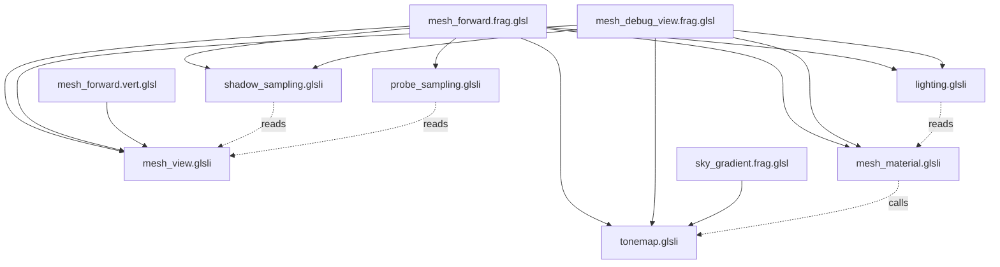

# Shaders

## Inventory

All engine GLSL lives in `engine/shaders`. There is no runtime shader
directory: engine shaders are compiled at build time and baked into the binary.

| File | Kind | Compiled into |
|---|---|---|
| `mesh_forward.vert.glsl` | vertex | `kMeshForwardVertSpv` |
| `mesh_forward.frag.glsl` | fragment | `kMeshForwardFragSpv` |
| `mesh_debug_view.frag.glsl` | fragment | `kMeshDebugViewFragSpv`, only when `SENCHA_ENABLE_RENDER_PROFILING` |
| `shadow_depth.vert.glsl` | vertex | `kShadowDepthVertSpv` |
| `shadow_depth.frag.glsl` | fragment | `kShadowDepthFragSpv` (empty body; depth only) |
| `sky_gradient.vert.glsl` | vertex | `kSkyGradientVertSpv` (full-screen triangle, no vertex buffer) |
| `sky_gradient.frag.glsl` | fragment | `kSkyGradientFragSpv` |
| `mesh_view.glsli` | include | frame UBO block and its structs |
| `mesh_material.glsli` | include | fragment inputs, push constants, bindless sampling, tonemap |
| `lighting.glsli` | include | direct-light terms and shadow visibility composition |
| `shadow_sampling.glsli` | include | spot and point shadow filters |
| `probe_sampling.glsli` | include | probe volume selection and SH evaluation |
| `tonemap.glsli` | include | exposure and the shoulder curve, shared by the mesh and sky passes |

Editor shaders live under `editor/kyusu/src/render` with their own pipelines and
are built the same way.

## Include topology



`tonemap.glsli` is the exception to the pattern below: it declares no
descriptors and reads no globals, taking exposure and knee as arguments, which
is what lets the sky pass share the display transform without inheriting the
material push block and the bindless sampler array.

Include order is load bearing and not defensive: the `.glsli` files declare no
include guards and assume their dependencies are already in scope.
`shadow_sampling.glsli` reads `frame.SpotShadows`, `probe_sampling.glsli` reads
`frame.ProbeVolumes` and the `MAX_*` constants, and `lighting.glsli` reads
`pushData.ReceiveShadows` and `pushData.SpecularIntensity`. Keep the order used
by `mesh_forward.frag.glsl`.

`mesh_debug_view.frag.glsl` defines `SENCHA_DEBUG_VIEWS` before including
`shadow_sampling.glsli`, which is what pulls in the raw (nearest,
non-comparison) samplers at set 2 bindings 3 and 4. The production shader never
sees those bindings, and shipping layouts stop at binding 2.

## Build pipeline

Offline, through CMake. Nothing compiles GLSL at runtime unless
`SENCHA_ENABLE_HOT_RELOAD` is on.

```
engine/shaders/foo.frag.glsl
  -> sencha_compile_shader   (glslc, -fshader-stage=frag --target-env=vulkan1.3 -O, -MD depfile)
  -> ${CMAKE_CURRENT_BINARY_DIR}/shaders/foo.frag.glsl.spv
  -> sencha_embed_spirv      (cmake -P EmbedSpirv.cmake)
  -> ${CMAKE_CURRENT_BINARY_DIR}/generated/shaders/kFooFragSpv.h
  -> #include <shaders/kFooFragSpv.h>
  -> Shaders->CreateModuleFromSpirv(kFooFragSpv, kFooFragSpvWordCount, "name")
```

`cmake/SenchaShaders.cmake` provides `sencha_compile_shader`,
`sencha_embed_spirv`, and `sencha_embed_text`. Wiring for the engine's five
shaders is in `engine/CMakeLists.txt` under `if(SENCHA_ENABLE_VULKAN)`.

glslc is invoked with `-MD -MF` and CMake consumes the depfile, so touching a
`.glsli` rebuilds only the shaders that include it, not the engine.

The generated header exposes a `constexpr uint32_t[]` plus a `WordCount`
constant. Module creation is therefore file-IO free, compiler-dependency free,
and costs nothing at startup beyond `vkCreateShaderModule`.

## Descriptor and interface contract

Every engine shader binds the same three sets. See
[vulkan-backend.md](vulkan-backend.md#descriptor-sets) for the full table.

```glsl
layout(set = 0, binding = 0) uniform MeshFrame { ... } frame;          // dynamic UBO
layout(set = 1, binding = 0) uniform sampler2D BindlessTextures[1024]; // material textures
layout(set = 2, binding = 0) uniform sampler2DShadow        SpotShadowAtlas;
layout(set = 2, binding = 1) uniform samplerCubeArrayShadow PointShadowCubes;
layout(set = 2, binding = 2) uniform sampler3D ProbeVolumes[8 * 3];
layout(push_constant) uniform MeshPush { ... } pushData;               // 80 bytes, FS only
```

Vertex attribute locations are shared between the forward and shadow vertex
shaders so the instance-matrix convention cannot drift: locations 3 to 6 are
always the four rows of the per-instance world matrix, whatever else a shader
declares.

The push block lives in one GLSL place: `mesh_material.glsli`, which both
fragment shaders include. The vertex shader carried a byte-identical copy for
years without reading a field of it, and the copy drifted -- stale names over
the right offsets -- so it was deleted and the push range narrowed to the
fragment stage. A vertex-stage consumer must widen the range in
`MeshForwardPass::Setup` and the `vkCmdPushConstants` flags together, which is
what makes a second silent copy impossible rather than merely discouraged.

## Specialization constants

`MATERIAL_UNLIT` (`constant_id = 0`, bool) and `MATERIAL_ALPHA_MASK`
(`constant_id = 1`, bool) in `mesh_forward.frag.glsl`; the debug-view shader
carries the mask constant too. The pipeline cache hashes fragment
specialization constants as part of the pipeline
desc, so the eight opaque variants are distinct `VkPipeline` objects sharing
two `VkShaderModule` objects.

Use a specialization constant, not a uniform branch, when the value is constant
for the whole draw and there are few enough combinations to enumerate. Use a
push constant when it varies per draw. Use the frame UBO when it varies per
frame.

## Keeping CPU and GPU structs in sync

There is no reflection step. Three mechanisms hold the contract:

1. **`static_assert` walls.** `engine/src/render/pass/MeshForwardPass.cpp` asserts the
   offset of every field of `MeshPushConstants`, `MeshInstanceData`,
   `MeshViewUniforms`, `GpuSpotShadow`, `GpuPointShadow`, and `GpuLight`, plus
   the total size of each. Adding a field in the wrong place fails the build.
2. **Hand-mirrored caps.** `engine/shaders/mesh_view.glsli` opens with
   `MAX_LIGHTS`, `MAX_SPOT_SHADOWS`, `MAX_POINT_SHADOWS`, `MAX_PROBE_VOLUMES`,
   and `PROBE_VOLUME_CHANNELS`, with a comment pointing at the C++ header. These
   are not generated; changing one side without the other produces a silently
   wrong UBO.
3. **`std140` discipline.** The frame block is a plain uniform block, so it obeys
   std140: `vec3` occupies 16 bytes, arrays of scalars are padded to 16, and
   struct members align to their largest member. The C++ side matches that by
   hand with explicit `Pad` members, which is why `MeshViewUniforms` has
   `ShadowPad1`, `ProbePad0`, `DebugViewPad0`, and so on.

The matrix convention: `Mat4` is row-major on the CPU and every upload
transposes (`camera.ViewProjection.Transposed()`, `item.WorldMatrix.Transposed()`),
so GLSL sees column-major matrices and `M * v` works as written.

## Hot reload

Under `SENCHA_ENABLE_HOT_RELOAD` (OFF in release), `VulkanShaderCache` gains
`LoadFromFile` (compiles GLSL through glslang, caches a `.spv` side-car
invalidated by mtime) and `CompileFromSource`. glslang targets Vulkan 1.3 and
SPIR-V 1.6, matching the offline glslc target.

Replacing a module does **not** invalidate pipelines. `VulkanPipelineCache` keys
on the `ShaderHandle`, so a reloaded module produces a new handle and the next
`GetGraphicsPipeline` call with the new desc creates a new pipeline; entries
referencing the old handle stay until the cache is destroyed. Any caller
implementing live reload has to re-run its `EnsurePipelines` equivalent with the
new handles.

## Debug-view shader

`mesh_debug_view.frag.glsl` implements fourteen channels selected by
`frame.DebugView` (see [instrumentation.md](instrumentation.md#debug-views)).
It is a separate shader on purpose: the production fragment shader contains no
debug branch, and the whole debug pipeline family is excluded from the build
when render profiling is off.

## Adding a shader

See [extending.md](extending.md#add-an-engine-shader).
